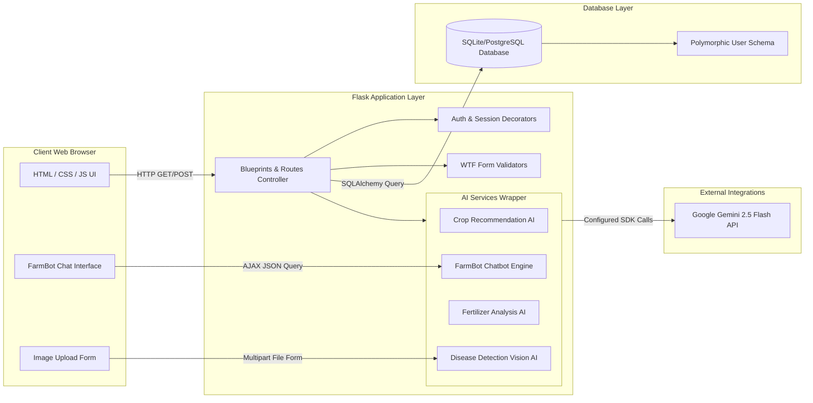
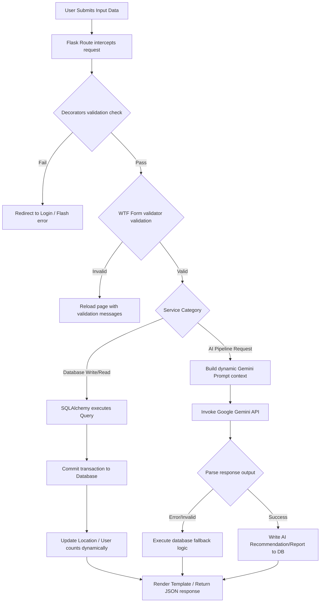

<!-- IMAGE: assets/banners/project-banner.png -->

# 🌾 Smart Farming AI

> **AI-Driven, Hyper-Local Precision Agriculture and Disease Detection Platform for Farmers and Government Planners.**

---

<p align="center">
  
  
  
  
  
  <br />
  
  
  
  
</p>

---

## 📖 Interactive Documentation Index

To make navigating our enterprise documentation suite seamless, use the interactive index below:

| Section | Icon | Path | Target Audience | Description |
| :--- | :---: | :--- | :--- | :--- |
| **Architecture** | 🏗 | [docs/architecture.md](docs/architecture.md) | Engineers / Architects | C4 context models, system topologies, and MVC patterns. |
| **Modules Guide** | 📦 | [docs/modules.md](docs/modules.md) | Developers | Detailed breakdown of routes, helpers, validation, and files. |
| **AI Pipelines** | 🤖 | [docs/ai-pipelines.md](docs/ai-pipelines.md) | Data Engineers / ML | Google Gemini system configurations, prompts, and schemas. |
| **Authentication** | 🔐 | [docs/authentication.md](docs/authentication.md) | Security Analysts | Session timeouts, hashing, and Role-Based Access Control (RBAC). |
| **Database Schema** | 🗄 | [docs/database.md](docs/database.md) | DB Administrators | Model entities, polymorphic mappings, constraints, and ERDs. |
| **API Blueprint** | 📡 | [docs/api.md](docs/api.md) | Developers | Complete endpoint routes, parameters, and request/response payloads. |
| **Deployment** | 🚀 | [docs/deployment.md](docs/deployment.md) | DevOps / SysAdmins | Gunicorn execution, Docker environments, and environment variables. |
| **Folder Structure** | 📁 | [docs/folder-structure.md](docs/folder-structure.md) | Contributors | Mapping of all folders, responsibilities, and import maps. |
| **Contributing** | 🤝 | [docs/contributing.md](docs/contributing.md) | Contributors | Code styles, formatting, branch guidelines, and PR processes. |
| **Roadmap** | 🛣 | [docs/roadmap.md](docs/roadmap.md) | Product Managers | Short, medium, and long-term milestones. |
| **Developer Guide** | 💻 | [docs/developer-guide.md](docs/developer-guide.md) | New Developers | Quick start developer guide on code flows and controllers. |
| **Security Audit** | 🛡 | [docs/security.md](docs/security.md) | Security Engineers | Detailed threat model, CSRF protection, and SQLi preventions. |
| **Testing Suite** | 🧪 | [docs/testing.md](docs/testing.md) | QA / Test Engineers | Unit testing, validation matrices, and edge-case verification. |
| **Performance** | ⚡ | [docs/performance.md](docs/performance.md) | Performance Engineers | DB WAL-mode pragma parameters, response latency, and scale strategies. |

---

## 🌟 Showcase

Explore the interactive interface of the Smart Farming AI platform. Each component is designed for high visual clarity, responsiveness, and accessibility:

### User Registration & Security
<!-- IMAGE: assets/screenshots/register-screen.png -->
*The secure registration form allows farmers to input their personal credentials and validate their locations using a real-time pincode database.*

### Farmer Dashboard & Control Center
<!-- IMAGE: assets/screenshots/farmer-dashboard.png -->
*The central hub for Farmers, displaying real-time soil nutrient counts, current crop profiles, generated fertilizer advice, and pest logs.*

### Government Planning & Analytics Dashboard
<!-- IMAGE: assets/screenshots/government-dashboard.png -->
*Government Users can track agricultural performance, view farmer counts, analyze localized crop coverage, and register new farmers.*

### Plant Disease Detection Pipeline
<!-- IMAGE: assets/screenshots/disease-detection.png -->
*Farmers upload a leaf image; the AI analyzes plant symptoms, predicts disease status, estimates confidence levels, and displays treatments.*

### FarmBot Interactive Chatbot
<!-- IMAGE: assets/screenshots/chatbot-interface.png -->
*A multi-turn chatbot that automatically pulls the Farmer's soil profile and historic recommendations to answer hyper-contextual agronomy queries.*

---

## 📌 Project Overview

### The Problem
Smallholder farmers in developing nations like India struggle to optimize crop yields due to unpredictable climate patterns, soil degradation, lack of scientific soil analysis, and delayed access to professional agronomic advice. Additionally, local government agricultural planning agencies lack real-time data regarding which crops are being cultivated at specific pincode levels, leading to poor resource distribution, crop supply imbalances, and delayed response to disease outbreaks.

### The Solution
Smart Farming AI addresses this by providing an integrated, localized, and intelligent software platform:
- **For Farmers:** Provides instant soil health assessments, personalized crop recommendations, organic and chemical disease remedies, and conversational agronomy advice.
- **For Government Users:** Offers a complete analytical map of their assigned pincodes, showing total active farmers, current crop distribution, rainfall, and temperature history.
- **For Admins:** Provides complete administrative oversight of user databases, crops metadata, and location master indexes.

### Why AI Was Used
Traditional decision-making algorithms rely on static lookup tables that fail to adapt to complex weather changes, variable pH balances, and multi-nutrient soil combinations. By integrating **Google Gemini 2.5 Flash**, the system achieves:
1. **Dynamic Heuristics:** Evaluating combinations of NPK levels, pH, temperature, and historical yield data in real-time.
2. **Computer Vision:** Instantly identifying visual patterns in plant leaves to diagnose pests and diseases without expensive laboratory tests.
3. **Conversational Context:** Powering FarmBot AI to provide low-friction guidance in natural language, automatically referencing the farmer's database record to answer questions.

---

## 🚀 Key Features

Our platform features a modular design with tailored user interfaces:

```
┌────────────────────────────────────────────────────────────────────────────────────────┐
│                                   SMART FARMING AI                                     │
├───────────────────────────┬────────────────────────────┬───────────────────────────────┤
│    🌾 FARMER INTERFACE    │   🏛 GOVERNMENT INTERFACE  │      ⚙ ADMIN INTERFACE       │
├───────────────────────────┼────────────────────────────┼───────────────────────────────┤
│ • Soil & NPK Tracking     │ • Regional Analytics       │ • Global User Management      │
│ • Gemini Crop Advice      │ • Farmer Registrations     │ • Location Pincode Database   │
│ • FarmBot Chatbot         │ • Regional Rainfall/Temp   │ • Crop Library Customizer     │
│ • Leaf Disease Diagnostics│ • Crop Coverage Reports    │ • Database Audit Logs         │
└───────────────────────────┴────────────────────────────┴───────────────────────────────┘
```

### 1. Farmer Core Features
*   **Soil Nutrient Profiles:** Log nitrogen, phosphorus, potassium (NPK), and pH levels.
*   **AI Crop Recommendation Engine:** Evaluates regional climate, rainfall, temperature, and soil indices to rank optimal crop options.
*   **FarmBot AI Chatbot:** Interactive assistant that answers general and personal farming queries by retrieving the database record.
*   **Leaf Disease Detection:** Upload crop photos to receive confidence scores, symptoms, organic treatments, and chemical remedies.
*   **Crop Update Propagation:** When updated, automatically archives old crops to previous crops and clears stale recommendations.

### 2. Government Analytics Features
*   **District and Pincode Dashboards:** View total registered farmers and active farmers inside assigned sectors.
*   **Area Statistics Customizer:** Update annual rainfall and average temperature across all local communities with a single action.
*   **Farmer Registry Control:** Register and edit farmer details directly from the field.
*   **Crop Recommendation Advisor:** Perform on-the-spot AI crop recommendation analysis on behalf of local farmers.

### 3. Administrative Control Features
*   **Full User Lifecycle:** Create, edit, and remove Government Users, Farmers, and Locations.
*   **Crop Master Catalog:** Expand the database library of supported crops, scientific metrics, production figures, and seasonal dates.
*   **Location Master Directory:** Query, filter, and add postal pincodes.

---

## 🛠 Technology Stack

The application utilizes a robust, lightweight, and modern software stack:

| Layer | Technology | Version | Purpose |
| :--- | :--- | :--- | :--- |
| **Backend Framework** | Flask | 2.3.2 | Core application routing, request handling, and views |
| **Database ORM** | Flask-SQLAlchemy | 3.0.5 | Object-Relational Mapping for models and relationship queries |
| **Database Migrations**| Flask-Migrate | 4.0.4 | Database schema migrations and version tracking |
| **AI Integration** | Google Generative AI | 0.3.2 | Integrates Gemini 2.5 Flash for Recommendations, Disease Detection, and Chatbot |
| **Image Processing** | Pillow (PIL) | >=10.3.0 | Image validation, RGB conversion, and resizing before AI submission |
| **WSGI Server** | Gunicorn | >=23.0.0 | Production-ready WSGI HTTP server for container routing |
| **Form Management** | Flask-WTF / WTForms | >=1.0.0 | CSRF-protected forms, validators, and HTML bindings |
| **Security Hashing** | Werkzeug | >=2.0.0 | Secure PBKDF2 password generation and validation |
| **Database Engine** | SQLite / PostgreSQL | - | Local file database / Production database compatibility |

---

## 🏗 System Architecture

The project is structured using the Model-View-Controller (MVC) architectural pattern:

<!-- IMAGE: assets/diagrams/system-architecture.png -->



### Repository Statistics (Overview)
- **Database Tables:** `users`, `farmers`, `govt_users`, `locations`, `crops`, `recommendations`, `disease_reports` (polymorphic structure).
- **Core Blueprints:** `auth_bp` (`/auth`), `api_bp` (`/api`), `farmer_bp` (`/farmer`), `govt_bp` (`/government`), `admin_bp` (`/admin`), `main_bp` (`/`).
- **AI Pipelines:** 4 pipelines utilizing `gemini-2.5-flash`.
- **Supported Roles:** `Admin`, `Government User`, `Farmer`.

---

## 🔄 Complete Data Flow

The diagram below details the data movement across the app, from the user action to the backend services, database operations, and AI validations:



---

## 📁 Repository Directory Structure

```
smart_farming_AI/
├── app/                        # Main Application Package
│   ├── admin/                  # Admin Blueprint (Routes, Forms)
│   ├── ai_services/            # Google Gemini AI Integration Wrappers
│   ├── auth/                   # Authentication Blueprint (Login, Register, API)
│   ├── farmer/                 # Farmer Blueprint (Dashboard, Chatbot)
│   ├── government/             # Government User Blueprint (Planning Dashboard)
│   ├── static/                 # Static CSS, background images
│   ├── templates/              # Jinja2 HTML Templates
│   ├── utils/                  # Core Utilities (Decorators, Counts Helpers, Validation)
│   ├── __init__.py             # Flask App factory initialization
│   ├── extensions.py           # Instantiation of Flask Extensions
│   └── models.py               # SQLAlchemy Database Models
├── assets/                     # Documentation Media Assets
│   ├── banners/                # Repo banners
│   ├── diagrams/               # SVG-ready diagrams
│   └── screenshots/            # App screenshots
├── docs/                       # Project Documentation Suite
│   ├── adr/                    # Architecture Decision Records
│   └── ...                     # Core markdown documentation modules
├── Dockerfile                  # Application Container Build Instructions
├── app.py                      # Application Startup Entry Point
├── run.py                      # Production Runner Script
├── config.py                   # Configuration Settings and env loading
└── requirements.txt            # Python Package Dependencies list
```

---

## ⚙️ Installation & Local Setup

### System Prerequisites
- Python 3.9, 3.10, or 3.11 installed.
- A valid Google Gemini API Key.

### Step 1: Clone the Repository
```bash
git clone https://github.com/AbhishekYadav2207/smart_farming_AI.git
cd smart_farming_AI
```

### Step 2: Set Up Virtual Environment
Create and activate a virtual environment to isolate project dependencies:

On Windows (Command Prompt):
```cmd
python -m venv venv
venv\Scripts\activate
```

On macOS / Linux:
```bash
python3 -m venv venv
source venv/bin/activate
```

### Step 3: Install Required Dependencies
```bash
pip install --upgrade pip
pip install -r requirements.txt
```

### Step 4: Configuration Setup
Create a `.env` file in the root directory by copying the sample environment template. Define the following values:

```env
# Application Settings
SECRET_KEY=e16221919a79e74e0b1f5cee866667991ec26d0aeb3568a4fc7b250db98a6cc5
FLASK_APP=run.py
FLASK_ENV=development

# Database Configuration (SQLite default, PostgreSQL for production)
DATABASE_URL=sqlite:///instance/farmers.db

# Google Gemini Credentials
GEMINI_API_KEY=AIzaSy...YourActualGeminiKeyHere

# Admin Default Credentials
ADMIN_USERNAME=admin
ADMIN_PASSWORD_HASH=scrypt:32768:8:1$...YourPasswordHashHere
```

### Step 5: Database Initialization
Execute the database initialization, migration, and update process:

```bash
flask db init
flask db migrate -m "Initial database schema deployment"
flask db upgrade
```

### Step 6: Launch the Local Server
```bash
python run.py
```
By default, the server will launch locally at `http://127.0.0.1:5000/`.

---

## 💻 Usage & Workflows

### 1. Farmer Registration & Analysis Flow
1. **Pincode Lookup:** Navigate to the registration page. Enter a 6-digit pincode. The form uses an AJAX query pointing to `/api/locations` to dynamically populate the location list.
2. **Account Creation:** Complete the form to create a Farmer profile.
3. **Nutrient Logging:** Log in and open the dashboard. Enter nitrogen, phosphorus, potassium, and soil pH levels.
4. **Crop Recommendation:** Submit the values. The system sends the data to Gemini, which returns 4–6 recommended crops.
5. **Disease Detection:** Navigate to the disease page. Upload a leaf image. Get real-time diagnostics.

### 2. Government User Dashboard Flow
1. **Regional Oversight:** The Government User logs in using credentials registered by the Admin.
2. **Regional Metrics:** View the total assigned farmers count. Update rainfall and temperature metrics for all locations matching their pincode.
3. **Register Farmer:** Register a new farmer manually from the fields.
4. **Crop Advisory:** Perform recommendations on behalf of local farmers.

---

## 🛡 Security & Compliance

*   **CSRF Protection:** Integrated via WTForms.
*   **Password Cryptography:** Government User password hashes are generated and verified using Werkzeug's `scrypt` hashing.
*   **Role-Based Decorators:** Customized views are wrapped with `@admin_required`, `@govt_required`, and `@farmer_required` to restrict URL access.
*   **Session Lifecycle:** Inactivity timeouts clear authorization cookies after 30 minutes of idle time.

For full security documentation, see [docs/security.md](docs/security.md).

---

## 🛣 Roadmap

*   **Short-Term:** Integrate localized weather API endpoints.
*   **Medium-Term:** Implement soil sensor hardware integrations via IoT gateways.
*   **Long-Term:** Add profit forecasting, seed subsidy tracking, and farmer-to-market systems.

For the full vision, see [docs/roadmap.md](docs/roadmap.md).

---

## 🤝 Contributing

Contributions are welcome! Please follow these guidelines:
1. Fork the repository.
2. Create a feature branch: `git checkout -b feature/your-awesome-feature`.
3. Verify that the application starts successfully and lint parameters are clean.
4. Submit a Pull Request.

For detailed standards, see [docs/contributing.md](docs/contributing.md).

---

## 📄 License

This project is licensed under the MIT License - see the `LICENSE` file for details.

---

## 🙏 Acknowledgements

*   **Data Source:** Pincode listings sourced from the Government of India open data platform (*data.gov.in*).
*   **LLM Engine:** Google DeepMind Gemini team for API access to `gemini-2.5-flash`.
*   **Sponsors:** Open source contributors promoting digital toolsets for sustainable agricultural planning.
