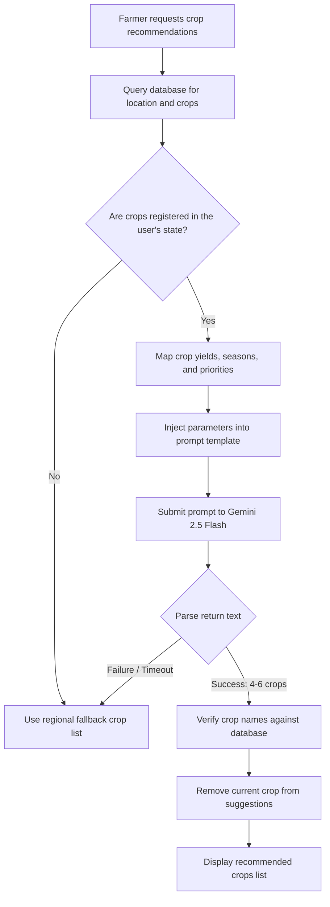
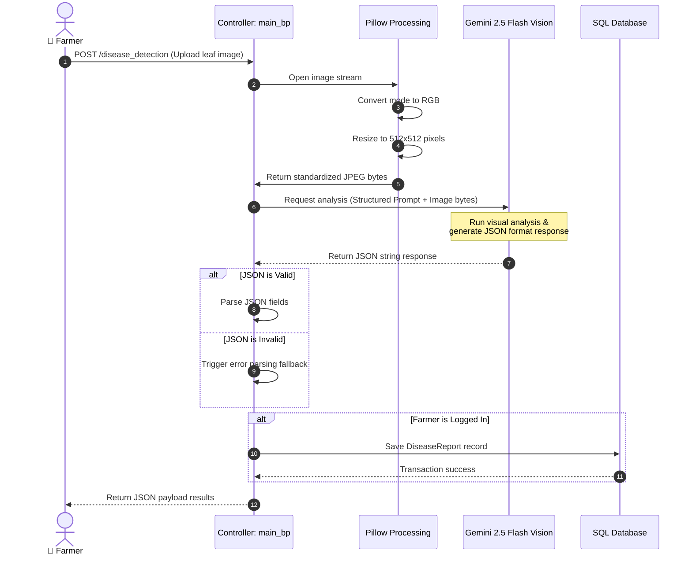

# Documentation

[Home](../README.md) | [Architecture](architecture.md) | [Modules](modules.md) | [AI Pipelines](ai-pipelines.md) | [Database](database.md) | [API](api.md) | [Deployment](deployment.md) | [Roadmap](roadmap.md) | [Developer Guide](developer-guide.md) | [Security](security.md) | [Testing](testing.md) | [Performance](performance.md)

---

## Table of Contents

- [Overview](#overview)
- [1. Crop Recommendation Pipeline](#1-crop-recommendation-pipeline)
  - [Workflow Sequence](#workflow-sequence)
  - [Prompt Template](#prompt-template)
  - [Prioritization & Sorting Rules](#prioritization--sorting-rules)
  - [Fallback Mechanisms](#fallback-mechanisms)
- [2. Disease Detection Pipeline](#2-disease-detection-pipeline)
  - [Vision Workflow Sequence](#vision-workflow-sequence)
  - [Visual Prompt Template](#visual-prompt-template)
  - [Response Validation & Formatting](#response-validation--formatting)
- [3. Fertilizer Recommendation Pipeline](#3-fertilizer-recommendation-pipeline)
  - [Prompt Template](#prompt-template-1)
  - [Response Parsing and Validation](#response-parsing-and-validation)
- [4. FarmBot Chatbot Pipeline](#4-farmbot-chatbot-pipeline)
  - [Context Generation Structure](#context-generation-structure)
  - [System Prompt Layout](#system-prompt-layout)
- [Current Implementation](#current-implementation)
- [Future Improvements](#future-improvements)

---

## Overview

The Smart Farming AI platform integrates Google Gemini 2.5 Flash to process structured agronomy analysis, image diagnostics, and natural language queries.

> [!NOTE]
> All AI integrations are configured using safety controls (`BLOCK_NONE` for testing) to prevent accidental filtering of agricultural terminology.

---

## 1. Crop Recommendation Pipeline

### Workflow Sequence

This diagram details the recommendation pipeline, highlighting database queries and sorting filters:



### Prompt Template
The pipeline generates the recommendation list by injecting parameters into the following prompt template:

```
You are an agricultural crop recommendation engine.
Your ONLY task is to recommend suitable crops.
Follow every instruction exactly.
Do NOT provide explanations, sentences, or any output other than crop names.

=====================
INPUT CONDITIONS
=====================
- Soil Type: [Soil Type]
- pH Level: [pH Level]
- Annual Rainfall: [Rainfall] mm
- Average Temperature: [Temperature]°C
- Location: [Location Name]
- Nitrogen: [Nitrogen] kg/ha
- Phosphorus: [Phosphorus] kg/ha
- Potassium: [Potassium] kg/ha
- Area of Land: [Land Area] hectares
- Current Crop: [Current Crop]

=====================
AVAILABLE CROPS FOR THIS LOCATION
=====================
[Crops Metadata List]

=====================
RULES FOR MISSING DATA
=====================
- If a field is marked "Not specified" or "Data not available", simply ignore that field.
- Do not reject a crop just because some information is missing.

=====================
PRIORITIZATION RULES
=====================
Rank crops using a combination of the provided data and real-world agricultural principles.
1.  **HIGH PRIORITY TIER:** Crops with exactly one prioritized state which was the state of the farmer and both `total_production` and `avg_yield` data available.
2.  **MEDIUM PRIORITY TIER:** Crops with exactly one prioritized state but without `total_production` or `avg_yield` data.
3.  **GENERAL PRIORITY TIER:** All other crops, sorted by:
    a. **Least** number of farmers (`no_of_farmers`).
    b. **Highest** `total_production`.
    c. **Highest** `avg_yield`.
    d. **Highest** `priority` (if available).

=====================
SUITABILITY RULES & EXTERNAL KNOWLEDGE
=====================
- Match crops with soil type, pH range, rainfall, and temperature.
- Ensure `water_requirements` are compatible with rainfall, considering **real-world climate patterns like monsoon, drought, or floods**.
- Prefer crops with low adoption in this region (`being_grown = False`) to promote crop diversity and sustainability.
- Avoid crops that severely deplete soil or require excessive irrigation.
- **If the provided list is small or not enough crops are suitable, consider crops known to thrive in similar Indian climates and soil types.** For example, Millets for arid regions, flood-tolerant Rice varieties for high rainfall areas, or legumes for nitrogen-deficient soil.
- **Reference knowledge of crop cycles (Kharif, Rabi, Zaid) and common agricultural practices in India to make informed choices.**

=====================
OUTPUT RULES
=====================
- Return ONLY a comma-separated list of **4–6 crop names**.
- The list must be sorted according to the "PRIORITIZATION RULES".
- Use **Title Case** for all crop names (e.g., Wheat, Maize, Chickpea).
- Do NOT output numbering, bullet points, or explanations.
- Do NOT include duplicate crops.
- Do NOT return fewer than 4 crops or more than 6 crops.
- Exclude the current crop ([Current Crop]) from the list.

=====================
FINAL REQUIREMENT
=====================
Output must be ONLY a single line:
- A comma-separated list
- Between 4 and 6 crop names
- Title Case
- No extra text, no explanations
```

### Prioritization & Sorting Rules
The sorting logic filters recommended crops into three priority tiers:
1.  **High Priority:** Crops with matching state records, valid historic yields, and verified local production statistics.
2.  **Medium Priority:** Crops with matching state records but missing historic performance metrics.
3.  **General Priority:** Remaining catalog crops, sorted by lowest active farmer adoption (to promote diversity), highest total production, highest average yield, and priority index.

### Fallback Mechanisms
If the Gemini API times out, returns an invalid structure, or suggesting fewer than 3 crops, the pipeline applies a database fallback helper:
- If a list of regional priority crops is available, the helper sorts and returns them.
- If the database query is empty, it returns a default list: `"Wheat, Rice, Maize, Soybean, Cotton, Sugarcane"`.

---

## 2. Disease Detection Pipeline

### Vision Workflow Sequence

This diagram details the steps to process leaf images and generate diagnostics:



### Visual Prompt Template
The vision pipeline submits the standardized image bytes along with the following prompt:

```
Analyze this plant image and return strict JSON:
{
    "disease": "string",
    "confidence": "High/Medium/Low",
    "symptoms": "string",
    "treatments": {
        "organic": ["string"],
        "chemical": ["string"]
    },
    "prevention": ["string"]
}
```

### Response Validation & Formatting
The validation code processes the JSON response as follows:
- Removes Markdown decorators (like ```json ... ```).
- Validates the presence of required keys: `disease`, `confidence`, `symptoms`, `treatments`, and `prevention`.
- Saves the results to the database if a `farmer_id` is active in the session.
- If parsing fails, it displays a low-confidence warning: "Analysis Error - Please try again with a clearer image."

---

## 3. Fertilizer Recommendation Pipeline

### Prompt Template
The pipeline generates fertilizer recommendations by injecting soil metrics and target crops into the following prompt:

```
Analyze the following crop and soil conditions to provide fertilizer recommendations:

Crop: [Crop Name]
Soil Conditions:
- Nitrogen: [Nitrogen] ppm
- Phosphorus: [Phosphorus] ppm
- Potassium: [Potassium] ppm
- pH Level: [pH Level]

Provide recommendations in JSON format with the following structure:
{
    "recommendation": "Specific fertilizer recommendations",
    "water_requirement": "Watering requirements for optimal growth",
    "notes": "Additional important notes for crop management"
}

Guidelines:
1. Be specific with fertilizer types and ratios.
2. Consider the soil pH in recommendations.
3. Provide practical, actionable advice.
4. Include any warnings about nutrient imbalances.
5. Keep recommendations concise but comprehensive.
6. Give the watering requirements in float format.
7. The fertilizer recommendation should be given with a specific fertilizer name only and additional details in notes.
```

### Response Parsing and Validation
- **JSON Validation:** Validates the presence of `recommendation`, `water_requirement`, and `notes`.
- **Parsing Fallback:** If the JSON is invalid, the helper logs the raw response text in the `recommendation` field, sets `water_requirement` to `0`, and records a warning note: "AI-generated recommendation - verify with local expert."

---

## 4. FarmBot Chatbot Pipeline

### Context Generation Structure
Before submitting a user query, FarmBot retrieves and aggregates the Farmer's database profile into a structured context payload:

```json
{
  "name": "Abhishek Yadav",
  "id": "farmer01",
  "phone": "+919876543210",
  "email": "farmer@example.com",
  "location": {
    "pincode": 201301,
    "name": "Noida SEC-62",
    "district": "Gautam Buddha Nagar",
    "state": "Uttar Pradesh",
    "annual_rainfall": 1020.5,
    "average_temperature": 28.2,
    "latitude": 28.62,
    "longitude": 77.38
  },
  "land_area": "4.5",
  "soil_type": "Alluvial",
  "ph_level": 6.8,
  "nitrogen": 42.0,
  "phosphorus": 18.5,
  "potassium": 32.4,
  "current_crop": "Wheat",
  "previous_crop": "Rice",
  "profile_complete": true,
  "latest_fertilizer_recommendation": {
    "crop": "Wheat",
    "date": "2026-07-10",
    "recommendation": "NPK 12-32-16",
    "water_requirement": 350.0,
    "notes": "Apply first dose during crown root initiation."
  },
  "latest_disease_report": {
    "disease_name": "Yellow Rust",
    "confidence": "High",
    "symptoms": "Yellow pustules on leaves.",
    "treatment": {
      "organic": ["Apply neem oil spray"],
      "chemical": ["Propiconazole 25% EC"]
    },
    "prevention": ["Use resistant varieties"]
  }
}
```

### System Prompt Layout
The generated context and the user query are wrapped in the following system prompt:

```
You are FarmBot AI, an intelligent assistant for farmers. Your goal is to provide helpful and concise answers based on the farmer's provided data and general agricultural knowledge.
The farmer's current data is:
[Farmer Context JSON]

Based on this data and your knowledge, answer the following query from the farmer:
"[User Query]"

If the query is about personal data, refer to the provided farmer data. If it's a general farming question, use your general knowledge.
Keep your answers clear, direct, and helpful. If you don't have enough information to answer a specific question about the farmer's data, state that clearly.
```

The output text is HTML-escaped to prevent cross-site scripting (XSS) issues before being returned to the user interface.

---

## Current Implementation

- **Google SDK Configuration:** The generative model is initialized using `gemini-2.5-flash`.
- **Response Validation:** All API integrations parse output responses, check schema fields, and handle errors.
- **Database Mappings:** Recommendations and disease diagnostics are written directly to local databases using the `Recommendation` and `DiseaseReport` models.

---

## Future Improvements

- **Local Model Fallback:** Run a lightweight agricultural model (like a fine-tuned Llama-3-8B) on a local server to handle recommendations when the internet is disconnected.
- **Async Processing:** Process image uploads asynchronously using queue workers to prevent HTTP timeout errors on slow connections.

---

Previous: [Modules](modules.md) | Next: [Database](database.md)
