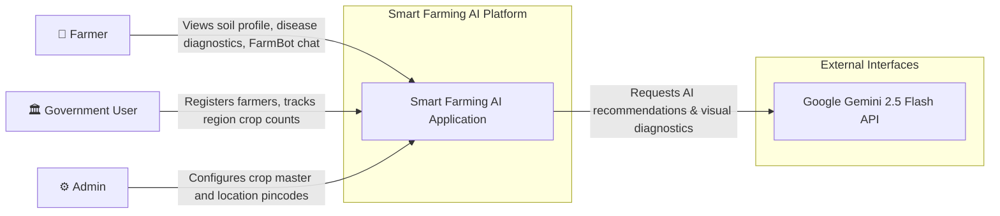
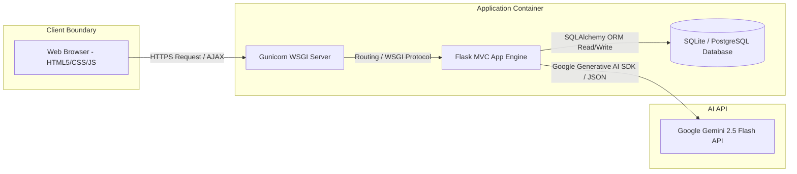
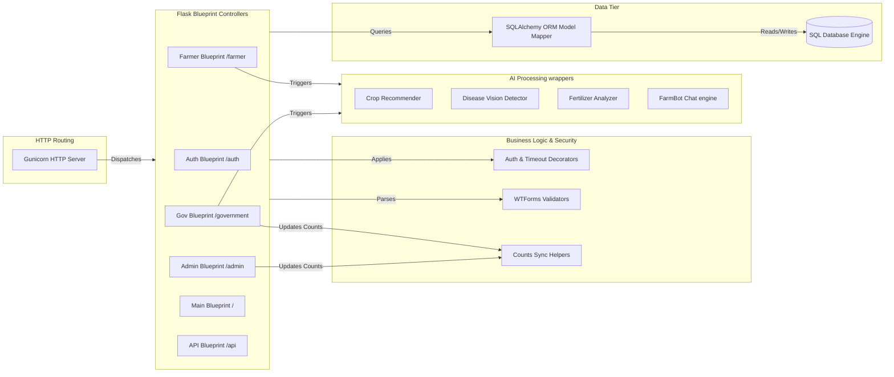
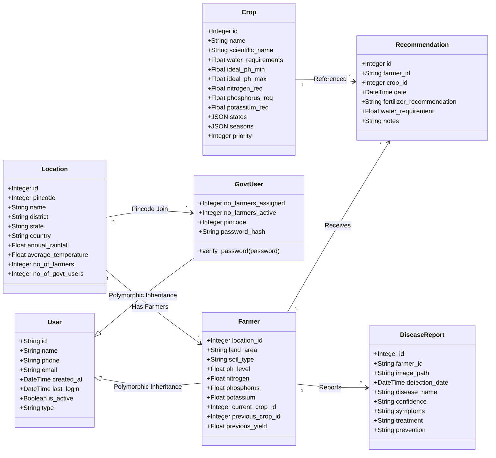
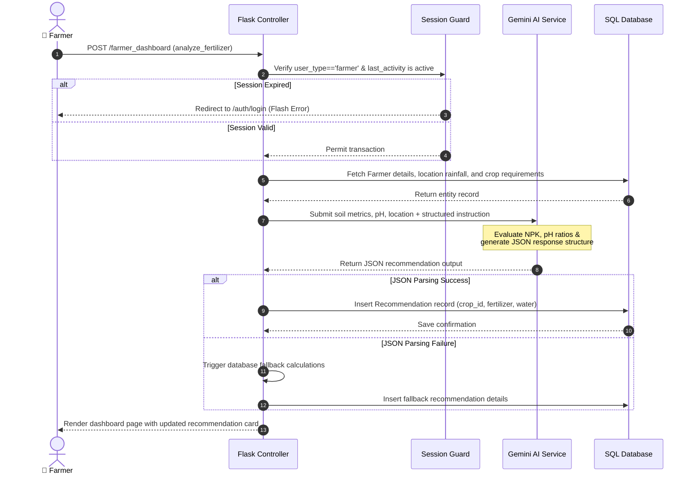
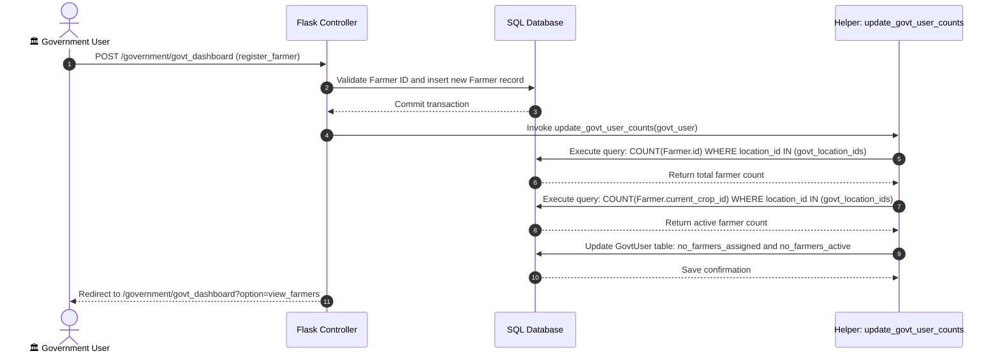
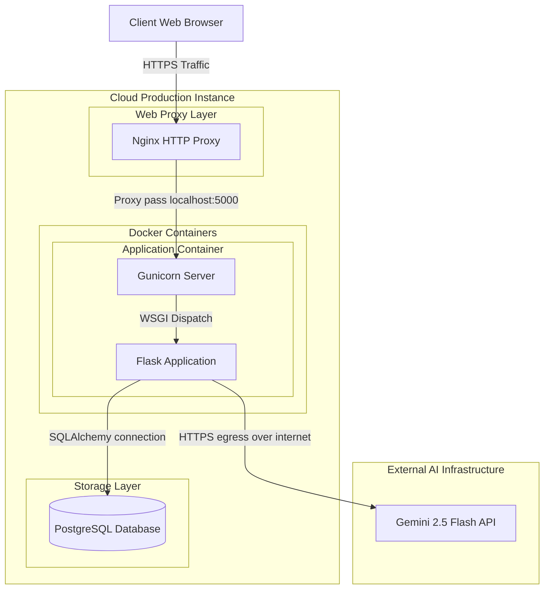

# Documentation

[Home](../README.md) | [Architecture](architecture.md) | [Modules](modules.md) | [AI Pipelines](ai-pipelines.md) | [Database](database.md) | [API](api.md) | [Deployment](deployment.md) | [Roadmap](roadmap.md) | [Developer Guide](developer-guide.md) | [Security](security.md) | [Testing](testing.md) | [Performance](performance.md)

---

## Table of Contents

- [Overview](#overview)
- [C4 Architecture Model](#c4-architecture-model)
  - [Level 1: System Context Diagram](#level-1-system-context-diagram)
  - [Level 2: Container Diagram](#level-2-container-diagram)
  - [Level 3: Component Diagram](#level-3-component-diagram)
  - [Level 4: Code Design (Class Relations)](#level-4-code-design-class-relations)
- [Model-View-Controller (MVC) Pattern](#model-view-controller-mvc-pattern)
- [Data Flow Topologies](#data-flow-topologies)
  - [AI Inference Request Lifecycle](#ai-inference-request-lifecycle)
  - [Government User Analytical Updates](#government-user-analytical-updates)
- [Physical Deployment Architecture](#physical-deployment-architecture)
- [Current Implementation](#current-implementation)
- [Future Improvements](#future-improvements)

---

## Overview

The Smart Farming AI platform is engineered on a decoupled, modular design pattern utilizing the Model-View-Controller (MVC) blueprint. By combining local relational database records with remote Google Gemini Large Language Model reasoning, the system generates targeted crop recommendations, disease treatments, and interactive conversations while maintaining strict local access control boundaries.

> [!NOTE]
> All systems are designed for high fault tolerance. If remote AI calls fail, the system falls back to regional data structures compiled from official agricultural statistics.

---

## C4 Architecture Model

The following section maps the platform using the C4 software modeling framework.

### Level 1: System Context Diagram

The System Context diagram details how external actors interact with the boundary of the Smart Farming AI platform and how the platform relies on external services.

<!-- IMAGE: assets/diagrams/c4-context.png -->

---

### Level 2: Container Diagram

The Container diagram details the high-level technology choices, storage boundaries, and routing protocols within the system context.

<!-- IMAGE: assets/diagrams/c4-container.png -->

---

### Level 3: Component Diagram

The Component diagram details the internal modular structure of the Flask application container, highlighting Blueprints, Forms, and AI Service wrappers.

<!-- IMAGE: assets/diagrams/c4-component.png -->

---

### Level 4: Code Design (Class Relations)

The Code diagram maps the structural database model class relationships, inheritance, and foreign keys.

---

## Model-View-Controller (MVC) Pattern

The system strictly adheres to Flask’s blueprint-driven MVC pattern:

| Component | Responsibility | Implementation Files |
| :--- | :--- | :--- |
| **Model** | Defines the data schema, relational constraints, security property setters, and validation hooks. | `app/models.py` |
| **View** | Renders HTML forms and data tables using Jinja2 templates, styled with static CSS layouts. | `app/templates/` and `app/static/` |
| **Controller** | Intercepts HTTP requests, runs security checks, executes business logic, queries database layers, and invokes AI scripts. | `app/auth/routes.py`, `app/farmer/routes.py`, `app/government/routes.py`, `app/admin/routes.py` |

---

## Data Flow Topologies

### AI Inference Request Lifecycle

The diagram below details the structural workflow when a Farmer requests an AI analysis:

---

### Government User Analytical Updates

The diagram below shows how farmer counts dynamically propagate up to the location and Government User statistics:

---

## Physical Deployment Architecture

The physical deployment topology routes client traffic through Nginx web servers into Docker containers hosting Gunicorn WSGI applications connected to PostgreSQL.

<!-- IMAGE: assets/diagrams/deployment-topology.png -->

---

## Current Implementation

The existing implementation supports:
1.  **MVC Blueprinting:** Separation of admin, auth, farmer, government, main, and API modules.
2.  **Polymorphic Model Inheritance:** The `users` table utilizes single-table inheritance mapping to `Farmer` and `GovtUser` child classes.
3.  **Local SQLite Engine:** Local database queries are handled through `instance/farmers.db` using WAL-mode sync.
4.  **Google Gemini Services:** Visual diagnostics and fertilizer recommendation scripts query `gemini-2.5-flash` natively.

---

## Future Improvements

Planned architectural improvements include:
- **Nginx & SSL Configuration:** Adding an Nginx reverse proxy configuration and Let's Encrypt SSL layers for secure routing.
- **Background Task Workers:** Integrating Celery with Redis to execute AI vision processing out-of-band, mitigating web request timeouts.
- **Multi-Node Database Replication:** Migrating state data to distributed PostgreSQL instances to scale read operations across multiple locations.

---

Previous: [Home](../README.md) | Next: [Modules](modules.md)
