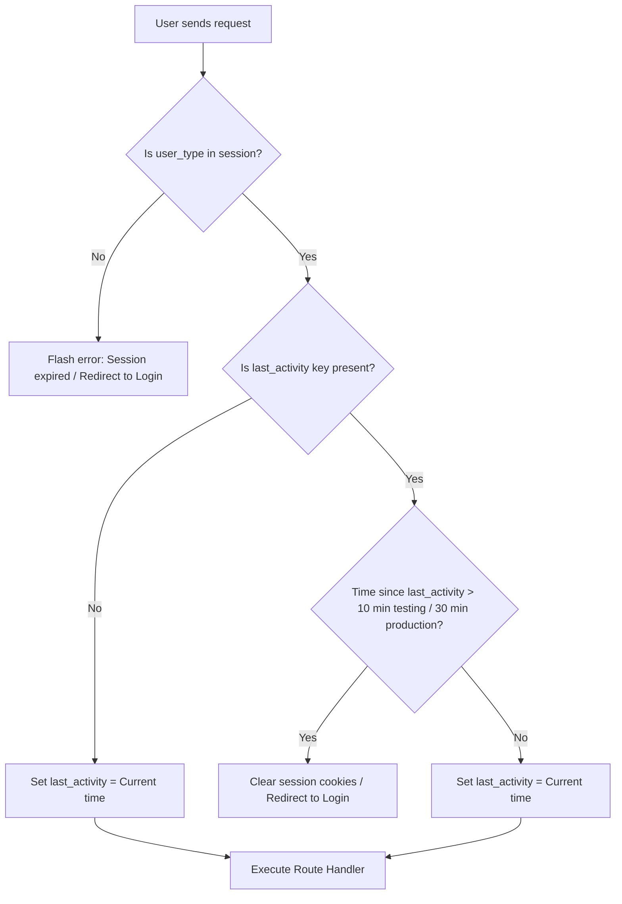

# Documentation

[Home](../README.md) | [Architecture](architecture.md) | [Modules](modules.md) | [AI Pipelines](ai-pipelines.md) | [Database](database.md) | [API](api.md) | [Deployment](deployment.md) | [Roadmap](roadmap.md) | [Developer Guide](developer-guide.md) | [Security](security.md) | [Testing](testing.md) | [Performance](performance.md)

---

## Table of Contents

- [Overview](#overview)
- [Role-Based Access Control (RBAC)](#role-based-access-control-rbac)
  - [Roles Matrix](#roles-matrix)
  - [RBAC Guard Decorators](#rbac-guard-decorators)
- [Session Lifecycle Management](#session-lifecycle-management)
  - [Session Timed Out Flowchart](#session-timed-out-flowchart)
  - [Session Security Configuration](#session-security-configuration)
- [Cryptography & Password Hashing](#cryptography--password-hashing)
- [Current Implementation](#current-implementation)
- [Future Improvements](#future-improvements)

---

## Overview

The Smart Farming AI platform uses session-based authentication to manage access controls. User identities are verified at login, and roles are enforced using route-level decorators.

---

## Role-Based Access Control (RBAC)

The system defines three distinct user roles:

### Roles Matrix

| Role | Target Model | Authentication Source | Permission Level | Scope of Access |
| :--- | :--- | :--- | :--- | :--- |
| **Farmer** | `Farmer` (polymorphic) | Local database table | User Level | Accesses their own soil metrics, crop profiles, recommendations, leaf diagnostics, and FarmBot chat sessions. |
| **Government User** | `GovtUser` (polymorphic) | Local database table | Regional Level | Registers and edits farmers, updates rainfall metrics, and runs crop recommendations within their assigned pincode. |
| **Admin** | Configuration | Environment variables | Master Level | Full access to user accounts, location directories, and the crop master catalog. |

---

### RBAC Guard Decorators

To enforce permissions, routes are wrapped with the following custom decorators from `app/utils/decorators.py`:

#### 1. Farmer Validation Decorator
```python
def farmer_required(f):
    @wraps(f)
    def decorated_function(*args, **kwargs):
        if session.get('user_type') != 'farmer':
            flash('Farmer required', 'error')
            return redirect(url_for('auth.login'))
        return f(*args, **kwargs)
    return decorated_function
```

#### 2. Government User Validation Decorator
```python
def govt_required(f):
    @wraps(f)
    def decorated_function(*args, **kwargs):
        if session.get('user_type') != 'govt':
            flash('Government User Required', 'error')
            return redirect(url_for('auth.login'))
        return f(*args, **kwargs)
    return decorated_function
```

#### 3. Admin Validation Decorator
```python
def admin_required(f):
    @wraps(f)
    def decorated_function(*args, **kwargs):
        if session.get('user_type') != 'admin':
            flash('Admin Required', 'error')
            return redirect(url_for('auth.login'))
        return f(*args, **kwargs)
    return decorated_function
```

---

## Session Lifecycle Management

The system tracks user sessions using encrypted, signed client-side cookies managed by Flask's session interface.

### Session Timed Out Flowchart

This flowchart shows how the session timeout decorator validates user activity on each request:



The timeout check is implemented in the `@session_required` decorator:
- Checks if the user is logged in.
- Calculates inactivity based on the `last_activity` timestamp.
- If the session is active, updates `last_activity` to the current time.
- If the session has expired, clears the session and redirects the user to the login page.

---

### Session Security Configuration

The session parameters are configured in `config.py` using secure cookie attributes:

```python
class Config:
    # Key used to sign session cookies
    SECRET_KEY = os.getenv('SECRET_KEY', 'e16221919a79e74e0b1f5cee866667991ec26d0aeb3568a4fc7b250db98a6cc5')
    
    # Session lifespan parameters
    PERMANENT_SESSION_LIFETIME = timedelta(minutes=30)
    SESSION_REFRESH_EACH_REQUEST = True
    
    # Security attributes
    SESSION_COOKIE_SECURE = True      # Cookie only sent over HTTPS connections
    SESSION_COOKIE_HTTPONLY = True    # Prevents client-side scripts from reading session cookies
    SESSION_COOKIE_SAMESITE = 'Lax'   # Mitigates Cross-Site Request Forgery (CSRF) risks
```

---

## Cryptography & Password Hashing

Government User credentials are secure-hashed before being written to the database:
- **Hashing Function:** Uses Werkzeug's implementation of the **scrypt** key derivation function.
- **Salt Generation:** Salting is handled automatically by the library on registration.
- **Verification:** Logins verify passwords using `check_password_hash` to compare submitted values against the database hash.

```python
class GovtUser(User):
    # Field mapping
    password_hash = db.Column(db.String(512))

    @property
    def password(self):
        # Prevent reading the password hash field
        raise AttributeError('password is not readable')
    
    @password.setter
    def password(self, password):
        if not password:
            raise ValueError('Password cannot be empty')
        # Generate scrypt hash
        self.password_hash = generate_password_hash(password)
    
    def verify_password(self, password):
        # Verify password hash
        return check_password_hash(self.password_hash, password)
```

---

## Current Implementation

- **Role Routing Guards:** Enforces access controls across the `admin`, `farmer`, and `government` blueprints.
- **Session Lifecycles:** Session lifetimes are refreshed on each request, with inactivity timeouts enforced by decorators.
- **Password Protection:** Uses scrypt hashing for Government User credentials.

---

## Future Improvements

- **Database-Backed Sessions:** Store session states in Redis to prevent session tampering.
- **Single Sign-On (SSO):** Integrate OAuth2 protocols to allow logins using external credentials.

---

Previous: [AI Pipelines](ai-pipelines.md) | Next: [Database](database.md)
