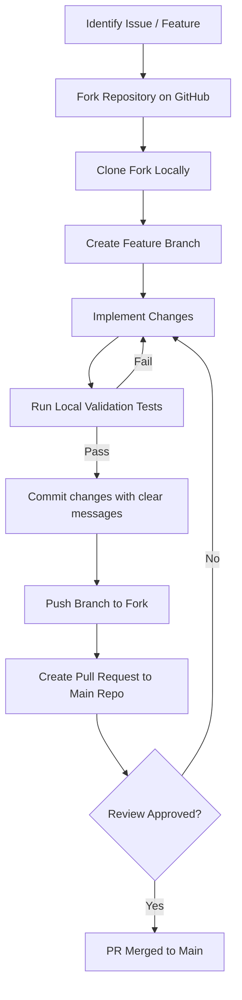

# Documentation

[Home](../README.md) | [Architecture](architecture.md) | [Modules](modules.md) | [AI Pipelines](ai-pipelines.md) | [Database](database.md) | [API](api.md) | [Deployment](deployment.md) | [Roadmap](roadmap.md) | [Developer Guide](developer-guide.md) | [Security](security.md) | [Testing](testing.md) | [Performance](performance.md)

---

## Table of Contents

- [Overview](#overview)
- [Code of Conduct](#code-of-conduct)
- [Development Workflow](#development-workflow)
  - [Contribution Flowchart](#contribution-flowchart)
- [Branch Naming Conventions](#branch-naming-conventions)
- [Coding & Formatting Standards](#coding--formatting-standards)
- [Pull Request Checklist](#pull-request-checklist)

---

## Overview

We welcome contributions to the Smart Farming AI platform. Follow this guide to keep code formatting, patterns, and pull request reviews consistent across the project.

---

## Code of Conduct

All contributors must maintain a professional and respectful environment. Be supportive, focus on constructive feedback, and prioritize issues that improve tool accessibility for local farming communities.

---

## Development Workflow

### Contribution Flowchart

This flowchart outlines the process from finding an issue to merging a pull request:



### Step-by-Step Guide

#### 1. Fork the Repository
Fork the project on GitHub and clone your fork locally:
```bash
git clone https://github.com/your-username/smart_farming_AI.git
cd smart_farming_AI
```

#### 2. Configure Remotes
Add the upstream repository to fetch the latest updates:
```bash
git remote add upstream https://github.com/AbhishekYadav2207/smart_farming_AI.git
```

#### 3. Keep Branches Updated
Before starting work, pull the latest changes from the upstream `main` branch:
```bash
git checkout main
git pull upstream main
```

---

## Branch Naming Conventions

Name your branches using the following naming structure:

| Category | Branch Prefix | Example Branch Name | Description |
| :--- | :--- | :--- | :--- |
| **Features** | `feature/` | `feature/soil-sensor-api` | Adding new features, routes, or schemas. |
| **Bug Fixes** | `bugfix/` | `bugfix/timeout-gemini` | Fixing bugs, route errors, or model issues. |
| **Hotfixes** | `hotfix/` | `hotfix/session-csrf` | Applying security patches directly to production. |
| **Documentation**| `docs/` | `docs/api-specifications` | Updating readmes, markdown guides, or comments. |

---

## Coding & Formatting Standards

We follow standard Python conventions to keep the codebase clean:
- **Style Guide:** Follow **PEP 8** guidelines.
- **Variable & Function Names:** Use `snake_case` (e.g., `validate_and_format_phone`, `ph_level`).
- **Class Definitions:** Use `CamelCase` (e.g., `Farmer`, `GovtUser`).
- **Indentation:** Use 4 spaces per indentation level.
- **Documentation:** Document all public helper classes and controller methods with docstrings:
  ```python
  def calculate_averages(data_list):
      """
      Calculates the numerical average of a list of floats.
      
      Args:
          data_list (list): A list containing floats or integers.
          
      Returns:
          float: The calculated average value, or 0.0 if empty.
          
      Raises:
          ValueError: If elements are not numeric.
      """
  ```

---

## Pull Request Checklist

Before submitting a pull request, verify that:
1.  **Code Starts Successfully:** Verify the development server launches locally without errors.
2.  **No Stale Imports:** Remove unused libraries and variables.
3.  **Local Tests Pass:** Run all validation scripts.
4.  **No Hardcoded Secrets:** Verify all credentials reside in the `.env` configuration file.
5.  **Documentation Updated:** Update the API or database docs if your PR changes routes or schemas.

---

Previous: [Production Deployment](deployment.md) | Next: [Roadmap](roadmap.md)
