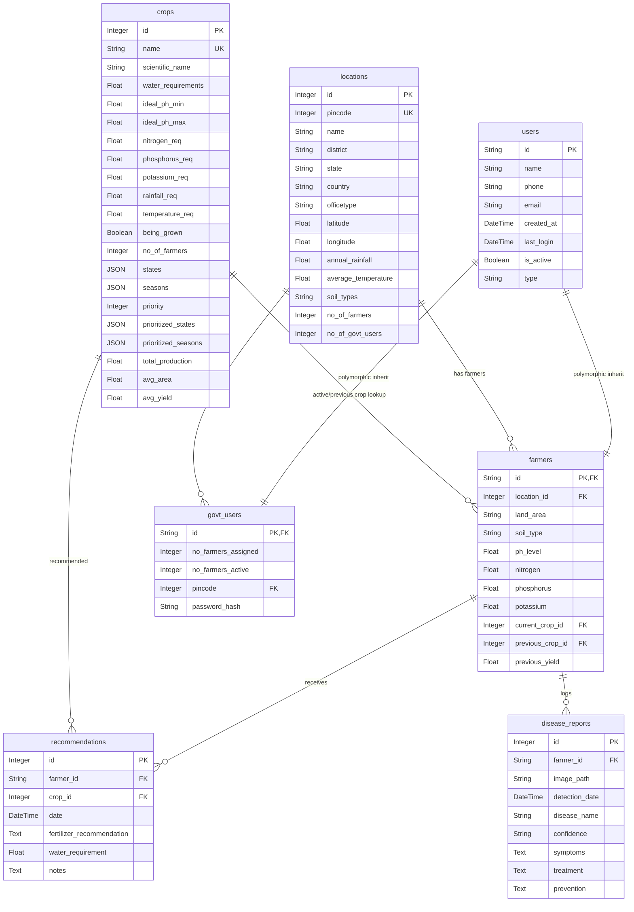

# Documentation

[Home](../README.md) | [Architecture](architecture.md) | [Modules](modules.md) | [AI Pipelines](ai-pipelines.md) | [Database](database.md) | [API](api.md) | [Deployment](deployment.md) | [Roadmap](roadmap.md) | [Developer Guide](developer-guide.md) | [Security](security.md) | [Testing](testing.md) | [Performance](performance.md)

---

## Table of Contents

- [Overview](#overview)
- [Entity Relationship Diagram (ERD)](#entity-relationship-diagram-erd)
- [Detailed Model Definitions](#detailed-model-definitions)
  - [1. User (Polymorphic Base Model)](#1-user-polymorphic-base-model)
  - [2. Farmer (Polymorphic Child Model)](#2-farmer-polymorphic-child-model)
  - [3. Government User (Polymorphic Child Model)](#3-government-user-polymorphic-child-model)
  - [4. Location](#4-location)
  - [5. Crop](#5-crop)
  - [6. Recommendation](#6-recommendation)
  - [7. Disease Report](#7-disease-report)
- [Database Event Listeners](#database-event-listeners)
- [Current Implementation](#current-implementation)
- [Future Improvements](#future-improvements)

---

## Overview

The Smart Farming AI application uses a relational schema managed via SQLAlchemy. User profiles are structured using Single-Table Inheritance (STI), allowing the `users` base model to share common columns (like name, email, and phone) with its polymorphic child models: `farmers` and `govt_users`.

---

## Entity Relationship Diagram (ERD)

The diagram below details the database schema tables, columns, data types, and relationships:

<!-- IMAGE: assets/diagrams/database-er.png -->



---

## Detailed Model Definitions

---

### 1. User (Polymorphic Base Model)
- **Table Name:** `users`
- **Description:** Holds base columns shared by both Farmers and Government Users.

| Column | Data Type | Modifiers | Description |
| :--- | :--- | :--- | :--- |
| `id` | `String(50)` | Primary Key | Unique user login identifier. |
| `name` | `String(100)` | Nullable=False | Full name of the user. |
| `phone` | `String(15)` | Nullable=False | Primary contact number. |
| `email` | `String(100)` | Nullable=True | Optional email address. |
| `created_at` | `DateTime` | Default=IST time | Account creation timestamp. |
| `last_login` | `DateTime` | Nullable=True | Last recorded activity timestamp. |
| `is_active` | `Boolean` | Default=True | Status flag to manage account access. |
| `type` | `String(20)` | Polymorphic discriminator | Determines the child class mapping (`farmer` or `govt_user`). |

---

### 2. Farmer (Polymorphic Child Model)
- **Table Name:** `farmers`
- **Description:** Child model inheriting from `users` that stores soil properties, crop selections, and land parameters.

| Column | Data Type | Modifiers | Description |
| :--- | :--- | :--- | :--- |
| `id` | `String(50)` | Primary Key, Foreign Key (`users.id`) | Links to the parent `users` record. |
| `location_id` | `Integer` | Foreign Key (`locations.id`) | Links the Farmer to a Location. |
| `land_area` | `String(5)` | Nullable=True | Total land area in hectares. |
| `soil_type` | `String(100)` | Nullable=True | Primary soil category (e.g., Alluvial, Clayey). |
| `ph_level` | `Float` | Nullable=True | Soil pH value (typically between 0.0 and 14.0). |
| `nitrogen` | `Float` | Nullable=True | Nitrogen level (mg/kg or ppm). |
| `phosphorus` | `Float` | Nullable=True | Phosphorus level (mg/kg or ppm). |
| `potassium` | `Float` | Nullable=True | Potassium level (mg/kg or ppm). |
| `current_crop_id` | `Integer` | Foreign Key (`crops.id`) | Links to the crop currently being grown. |
| `previous_crop_id`| `Integer` | Foreign Key (`crops.id`) | Links to the previously grown crop. |
| `previous_yield` | `Float` | Nullable=True | Yield recorded for the previous crop (tons/hectare). |

#### Mapped Relationships:
- **`location`:** `db.relationship('Location', back_populates='farmers')`
- **`current_crop`:** `db.relationship('Crop', foreign_keys=[current_crop_id], back_populates='farmers_current')`
- **`previous_crop`:** `db.relationship('Crop', foreign_keys=[previous_crop_id], back_populates='farmers_previous')`
- **`recommendations`:** `db.relationship('Recommendation', back_populates='farmer', cascade='all, delete-orphan')`
- **`disease_reports`:** `db.relationship('DiseaseReport', backref='farmer', lazy='dynamic', cascade='all, delete-orphan')`

#### Properties:
- **`profile_complete` (hybrid_property):** Returns `True` if all required soil properties (`soil_type`, `ph_level`, `nitrogen`, `phosphorus`, `potassium`) are configured.

---

### 3. Government User (Polymorphic Child Model)
- **Table Name:** `govt_users`
- **Description:** Child model inheriting from `users` that stores regional assignments and passwords.

| Column | Data Type | Modifiers | Description |
| :--- | :--- | :--- | :--- |
| `id` | `String(50)` | Primary Key, Foreign Key (`users.id`) | Links to the parent `users` record. |
| `no_farmers_assigned`| `Integer` | Default=0 | Total farmers registered under the user's pincode. |
| `no_farmers_active` | `Integer` | Default=0 | Farmers with active crop profiles under the user's pincode. |
| `pincode` | `Integer` | Foreign Key (`locations.pincode`) | The primary postal service area assigned to the user. |
| `password_hash` | `String(512)` | Nullable=False | Cryptographic scrypt password hash. |

#### Mapped Relationships:
- **`pincode_obj`:** `db.relationship('Location', primaryjoin='GovtUser.pincode==Location.pincode', back_populates='govt_users', viewonly=True)`

#### Properties:
- **`locations`:** Returns all `Location` records matching the user's assigned `pincode`.
- **`location_ids`:** Returns a list of primary keys for all locations under the user's assigned `pincode`.

---

### 4. Location
- **Table Name:** `locations`
- **Description:** Holds geographical boundaries, weather coordinates, climate metrics, and aggregate user counts.

| Column | Data Type | Modifiers | Description |
| :--- | :--- | :--- | :--- |
| `id` | `Integer` | Primary Key, Autoincrement | Unique location identifier. |
| `pincode` | `Integer` | Nullable=False, Index | 6-digit postal pincode. |
| `name` | `String(100)` | Nullable=False | Name of the sub-district or region. |
| `district` | `String(100)` | Nullable=False | District administrative name. |
| `state` | `String(100)` | Nullable=False | Indian state name. |
| `country` | `String(100)` | Default='India' | Country name. |
| `officetype` | `String(50)` | Nullable=True | Category description for local offices. |
| `latitude` | `Float` | Nullable=True | Latitude coordinate. |
| `longitude` | `Float` | Nullable=True | Longitude coordinate. |
| `annual_rainfall` | `Float` | Nullable=True | Regional annual rainfall average in millimeters. |
| `average_temperature` | `Float` | Nullable=True | Regional average temperature in Celsius. |
| `soil_types` | `String(255)` | Nullable=True | Soil types found in the region. |
| `no_of_farmers` | `Integer` | Default=0 | Total active farmers registered at this location. |
| `no_of_govt_users` | `Integer` | Default=0 | Total Government Users assigned to this location. |

#### Mapped Relationships:
- **`farmers`:** `db.relationship('Farmer', back_populates='location', cascade='all, delete-orphan')`
- **`govt_users`:** `db.relationship('GovtUser', primaryjoin='GovtUser.pincode==Location.pincode', back_populates='pincode_obj', viewonly=True)`

---

### 5. Crop
- **Table Name:** `crops`
- **Description:** The system master catalog of supported crops, ideal soil parameters, seasonal availability, and yield metrics.

| Column | Data Type | Modifiers | Description |
| :--- | :--- | :--- | :--- |
| `id` | `Integer` | Primary Key | Unique crop identifier. |
| `name` | `String(100)` | Unique, Nullable=False | Common crop name. |
| `scientific_name` | `String(100)` | Nullable=True | Scientific name of the crop. |
| `water_requirements`| `Float` | Nullable=True | Optimal water requirement in millimeters. |
| `ideal_ph_min` | `Float` | Nullable=True | Minimum pH threshold for cultivation. |
| `ideal_ph_max` | `Float` | Nullable=True | Maximum pH threshold for cultivation. |
| `nitrogen_req` | `Float` | Nullable=True | Target nitrogen requirement. |
| `phosphorus_req` | `Float` | Nullable=True | Target phosphorus requirement. |
| `potassium_req` | `Float` | Nullable=True | Target potassium requirement. |
| `rainfall_req` | `Float` | Nullable=True | Minimum rainfall requirement. |
| `temperature_req` | `Float` | Nullable=True | Minimum temperature threshold. |
| `being_grown` | `Boolean` | Default=False | Indicates if the crop is active in the region. |
| `no_of_farmers` | `Integer` | Default=0 | Total farmers currently growing this crop. |
| `states` | `JSON` | Default=[] | States where this crop is grown. |
| `seasons` | `JSON` | Default=[] | Harvest seasons (e.g., Rabi, Kharif). |
| `priority` | `Integer` | Default=0 | Priority rank index. |
| `prioritized_states`| `JSON` | Default=[] | States with priority crop support. |
| `prioritized_seasons`| `JSON` | Default=[] | Seasons with priority crop support. |
| `total_production` | `Float` | Default=0.0 | Cumulative production volume. |
| `avg_area` | `Float` | Default=0.0 | Average cultivation land area. |
| `avg_yield` | `Float` | Default=0.0 | Yield performance ratio (production/area). |

#### Mapped Relationships:
- **`recommendations`:** `db.relationship('Recommendation', back_populates='crop')`
- **`farmers_current`:** `db.relationship('Farmer', foreign_keys='Farmer.current_crop_id', backref='current_crop_ref')`
- **`farmers_previous`:** `db.relationship('Farmer', foreign_keys='Farmer.previous_crop_id', backref='previous_crop_ref')`

---

### 6. Recommendation
- **Table Name:** `recommendations`
- **Description:** Logs fertilizer and water recommendations generated by the AI pipelines.

| Column | Data Type | Modifiers | Description |
| :--- | :--- | :--- | :--- |
| `id` | `Integer` | Primary Key | Unique recommendation identifier. |
| `farmer_id` | `String(50)` | Foreign Key (`farmers.id`) | The Farmer receiving the recommendation. |
| `crop_id` | `Integer` | Foreign Key (`crops.id`) | The crop analyzed for the recommendation. |
| `date` | `DateTime` | Default=IST time | Log entry timestamp. |
| `fertilizer_recommendation` | `Text` | Nullable=True | Detailed AI fertilizer recommendations. |
| `water_requirement` | `Float` | Nullable=True | Target water application volumes. |
| `notes` | `Text` | Nullable=True | Additional notes generated by the AI. |

---

### 7. Disease Report
- **Table Name:** `disease_reports`
- **Description:** Logs leaf diagnostics, confidence scores, and recommended remedies generated by the vision pipeline.

| Column | Data Type | Modifiers | Description |
| :--- | :--- | :--- | :--- |
| `id` | `Integer` | Primary Key, Autoincrement | Unique log identifier. |
| `farmer_id` | `String(50)` | Foreign Key (`farmers.id`) | The Farmer who submitted the diagnostic request. |
| `image_path` | `String(255)` | Nullable=False | Location path of the uploaded leaf photo. |
| `detection_date` | `DateTime` | Default=IST time | Log entry timestamp. |
| `disease_name` | `String(100)` | Nullable=True | Predicted name of the crop disease. |
| `confidence` | `String(50)` | Nullable=True | Confidence score (High, Medium, or Low). |
| `symptoms` | `Text` | Nullable=True | Symptoms identified by the AI. |
| `treatment` | `Text` | Nullable=True | Recommended treatments (JSON array string). |
| `prevention` | `Text` | Nullable=True | Recommended prevention steps (JSON array string). |

---

## Database Event Listeners

To maintain database consistency when configurations change, the system uses SQLAlchemy event listeners in `app/models.py`:

### Crop Update Listener
Manages previous crop records when a Farmer changes their current crop configuration.

```python
@event.listens_for(Farmer.current_crop, 'set')
def update_previous_crop(target, value, oldvalue, initiator):
    # If a current crop exists, archive it to the previous crop field
    if oldvalue and oldvalue != value:
        target.previous_crop = oldvalue
```

---

## Current Implementation

- **SQLite Support:** Uses SQLite configurations by default, structured in `instance/farmers.db`.
- **Inheritance Mapping:** Utilizes polymorphic single-table mapping to handle Farmer and Government User roles.
- **Relational Integrity:** Implements cascade rules (`all, delete-orphan`) on child relationships to prevent orphaned records when user profiles are deleted.

---

## Future Improvements

- **Database Migration:** Migrate production environments to PostgreSQL to support write locking and scaling.
- **Audit Logging:** Add an audit logging table to track changes to sensitive records, such as location and user profiles.

---

Previous: [Authentication](authentication.md) | Next: [API Reference](api.md)
