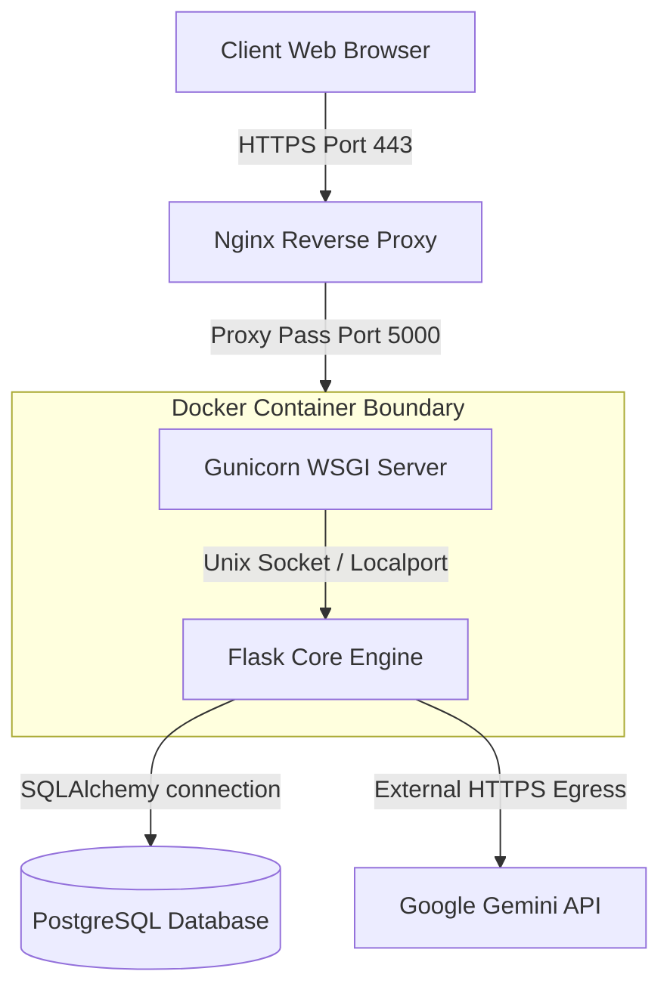

# Documentation

[Home](../README.md) | [Architecture](architecture.md) | [Modules](modules.md) | [AI Pipelines](ai-pipelines.md) | [Database](database.md) | [API](api.md) | [Deployment](deployment.md) | [Roadmap](roadmap.md) | [Developer Guide](developer-guide.md) | [Security](security.md) | [Testing](testing.md) | [Performance](performance.md)

---

## Table of Contents

- [Overview](#overview)
- [Deployment Topology Diagram](#deployment-topology-diagram)
- [Environment Configurations](#environment-configurations)
- [Container Deployment (Implemented)](#container-deployment-implemented)
  - [Dockerfile Reference](#dockerfile-reference)
  - [Build and Run Commands](#build-and-run-commands)
- [Database Provisioning](#database-provisioning)
- [Proposed Production Deployment (Future Improvements)](#proposed-production-deployment-future-improvements)
  - [1. Production Gunicorn Configuration](#1-production-gunicorn-configuration)
  - [2. Nginx Reverse Proxy Server Block](#2-nginx-reverse-proxy-server-block)
  - [3. SSL Security Configuration](#3-ssl-security-configuration)
- [Infrastructure Scaling](#infrastructure-scaling)

---

## Overview

The Smart Farming AI platform is containerized using Docker, exposing a Gunicorn WSGI server. This document outlines the existing container configurations, database settings, and recommended production setups.

---

## Deployment Topology Diagram

The diagram below details the production network topology, routing traffic from clients through Nginx to the containerized Gunicorn server:

<!-- IMAGE: assets/diagrams/deployment-topology.png -->



---

## Environment Configurations

The application reads its configuration from the system environment using a `.env` file. These values must be set in your production environment:

| Key | Format | Default | Description |
| :--- | :--- | :--- | :--- |
| `SECRET_KEY` | Hex String | Generated Default | Signs session cookies and protects against CSRF attacks. |
| `DATABASE_URL` | URI String | `sqlite:///instance/farmers.db` | Target database connection URI. (Set to `postgresql://...` in production). |
| `GEMINI_API_KEY` | API Key String | None | Google API key used to access Gemini services. |
| `ADMIN_USERNAME` | String | `admin` | Default administrator username. |
| `ADMIN_PASSWORD_HASH` | Cryptographic Hash | None | `scrypt` password hash used to secure the admin panel. |

---

## Container Deployment (Implemented)

The repository includes a `Dockerfile` in the root directory to containerize the Flask application.

### Dockerfile Reference
```dockerfile
FROM python:3.9-slim

WORKDIR /app

COPY requirements.txt .
RUN pip install --no-cache-dir -r requirements.txt

COPY . .

ENV FLASK_APP=run.py
ENV FLASK_ENV=production

CMD ["gunicorn", "--bind", "0.0.0.0:5000", "run:app"]
```

---

### Build and Run Commands

To build and run the application container locally:

#### 1. Build the Docker Image
```bash
docker build -t smart-farming-ai:latest .
```

#### 2. Run the Container
```bash
docker run -d \
  -p 5000:5000 \
  --name smart-farming-container \
  --env-file .env \
  smart-farming-ai:latest
```

---

## Database Provisioning

- **Default (Local/Testing):** The application defaults to using SQLite (`instance/farmers.db`). Ensure the `instance` folder has write permissions in your Docker environment.
- **Production (PostgreSQL):** PostgreSQL is supported via `psycopg2-binary` (included in `requirements.txt`). To configure PostgreSQL, set the `DATABASE_URL` environment variable:
  ```env
  DATABASE_URL=postgresql+psycopg2://db_user:db_password@db_host:5432/db_name?sslmode=require
  ```
- **Database Migrations:** Run migrations inside the container using the Flask CLI:
  ```bash
  docker exec -it smart-farming-container flask db upgrade
  ```

---

## Proposed Production Deployment (Future Improvements)

The following configurations are recommended to transition from development to a production-ready infrastructure.

### 1. Production Gunicorn Configuration
For production environments, we recommend running Gunicorn with a dedicated configuration file (`gunicorn_config.py`):

```python
# gunicorn_config.py
import multiprocessing

bind = "0.0.0.0:5000"
workers = multiprocessing.cpu_count() * 2 + 1  # Standard worker count formula
worker_class = "gthread"                      # Uses threads to handle slow client requests
threads = 4                                    # Concurrent threads per worker process
timeout = 60                                   # Timeout limit for slow AI processes
keepalive = 2                                  # Active keepalive connections limit
```

Launch Gunicorn using the configuration file:
```bash
gunicorn -c gunicorn_config.py run:app
```

---

### 2. Nginx Reverse Proxy Server Block
We recommend deploying Nginx as a reverse proxy in front of Gunicorn to handle static assets and manage client connections:

```nginx
# /etc/nginx/sites-available/smart_farming_ai
server {
    listen 80;
    server_name smartfarming.example.com;

    # Redirect all HTTP traffic to HTTPS
    location / {
        return 301 https://$host$request_uri;
    }
}

server {
    listen 443 ssl http2;
    server_name smartfarming.example.com;

    # SSL Certificate Paths
    ssl_certificate /etc/letsencrypt/live/smartfarming.example.com/fullchain.pem;
    ssl_certificate_key /etc/letsencrypt/live/smartfarming.example.com/privkey.pem;

    # Optimized SSL settings
    ssl_protocols TLSv1.2 TLSv1.3;
    ssl_ciphers HIGH:!aNULL:!MD5;
    ssl_prefer_server_ciphers on;

    # Static Assets Cache Control
    location /static/ {
        alias /app/app/static/;
        expires 30d;
        add_header Cache-Control "public, no-transform";
    }

    # Reverse Proxy configuration
    location / {
        proxy_pass http://127.0.0.1:5000;
        proxy_set_header Host $host;
        proxy_set_header X-Real-IP $remote_addr;
        proxy_set_header X-Forwarded-For $proxy_add_x_forwarded_for;
        proxy_set_header X-Forwarded-Proto $scheme;
        
        # Timeout limits for Gemini AI processing
        proxy_read_timeout 60s;
        proxy_connect_timeout 60s;
    }
}
```

---

### 3. SSL Security Configuration
To secure user data in transit, we recommend using Certbot to provision Let's Encrypt certificates:

```bash
# Install Certbot and the Nginx plugin
sudo apt update
sudo apt install certbot python3-certbot-nginx

# Obtain and configure SSL certificates
sudo certbot --nginx -d smartfarming.example.com
```

---

## Infrastructure Scaling

- **Horizontal Scaling:** Run multiple application containers behind an Nginx load balancer. Set up session stickiness or migrate session storage to a shared Redis cluster.
- **AI Rate Limits:** Monitor Google Gemini API quotas. If rate limits are reached, implement round-robin routing across multiple API keys.

---

Previous: [API Reference](api.md) | Next: [Roadmap](roadmap.md)
