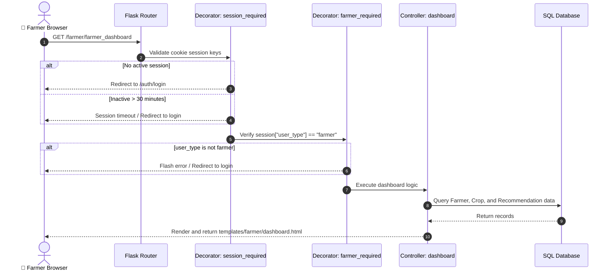
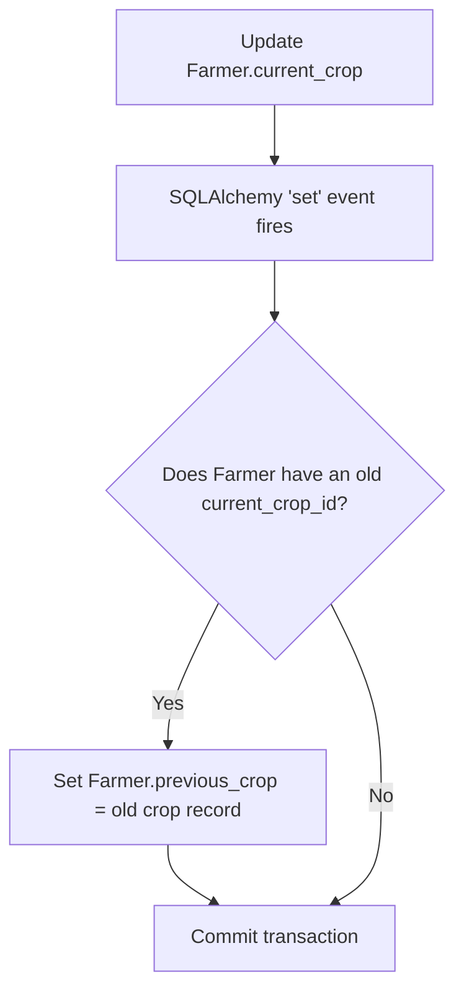

# Documentation

[Home](../README.md) | [Architecture](architecture.md) | [Modules](modules.md) | [AI Pipelines](ai-pipelines.md) | [Database](database.md) | [API](api.md) | [Deployment](deployment.md) | [Roadmap](roadmap.md) | [Developer Guide](developer-guide.md) | [Security](security.md) | [Testing](testing.md) | [Performance](performance.md)

---

## Table of Contents

- [Overview](#overview)
- [How Routes Work](#how-routes-work)
  - [Route Processing Diagram](#route-processing-diagram)
- [Model Interactions & Event Chains](#model-interactions--event-chains)
  - [Previous Crop Update Event Chain](#previous-crop-update-event-chain)
- [AI Service Wrapper Mappings](#ai-service-wrapper-mappings)
- [Application Configuration](#application-configuration)
- [Sync Helpers and Counts Calculations](#sync-helpers-and-counts-calculations)
- [Local Debugging Workflow](#local-debugging-workflow)

---

## Overview

This guide details how controllers, database models, AI scripts, helper functions, and settings files work together in the Smart Farming AI codebase.

---

## How Routes Work

The application uses Flask Blueprints to separate route groups, registered in `app/__init__.py`. Routes are protected by decorators that check the user's role:

```
Request ──> [Blueprint Match] ──> [@session_required] ──> [@farmer_required] ──> [Route Logic]
```

### Route Processing Diagram

This diagram details the lifecycle of a request to the farmer dashboard:



---

## Model Interactions & Event Chains

Database models reside in `app/models.py`, inheriting from the shared extension engine.

### Previous Crop Update Event Chain

This flowchart shows how updating a Farmer's current crop automatically moves their old crop record to `previous_crop`:



The crop archiver event handler in `app/models.py`:
- Listens for updates to `Farmer.current_crop`.
- Archives the existing crop to `previous_crop` if the new crop is different.
- Commits the transaction to save changes.

---

## AI Service Wrapper Mappings

The `app/ai_services` package acts as the integration layer with Google Gemini 2.5 Flash:

```
[Route Controller] ──> [AI service analyzer wrapper] ──> [Gemini API SDK]
```

To call the AI helpers in your code:

```python
# Import the services
from app.ai_services import crop_recommendation, disease_detection, fertilizer_analysis, chatbot_ai

# Execute recommendation queries
crop_list_string = crop_recommendation.analyze(
    soil_type="Alluvial", 
    pH_level=6.5, 
    rainfall=1200.0, 
    temperature=28.0, 
    location_name="Noida",
    nitrogen=45.0, 
    phosphorus=22.0, 
    potassium=35.0, 
    area_of_land=2.5
)

# Returns a comma-separated string, e.g., "Wheat, Rice, Barley, Maize"
```

---

## Application Configuration

Settings are managed in `config.py`. The `Config` class reads values from the environment:

```python
import os
from dotenv import load_dotenv

load_dotenv()

class Config:
    # Key used to sign session cookies
    SECRET_KEY = os.getenv('SECRET_KEY', 'default_secret_key')
    
    # Database path configuration
    SQLALCHEMY_DATABASE_URI = os.getenv('DATABASE_URL', 'sqlite:///farmers.db')
    SQLALCHEMY_TRACK_MODIFICATIONS = False
    
    # Google API Key for Gemini
    GEMINI_API_KEY = os.getenv('GEMINI_API_KEY')
    
    # Session lifespan parameters
    PERMANENT_SESSION_LIFETIME = timedelta(minutes=30)
```

---

## Sync Helpers and Counts Calculations

To display metrics on dashboards, database counters are synced using helpers in `app/utils/helpers.py`:

- `update_govt_user_counts(govt_user)`: Counts registered and active farmers matching a Government User's pincode and updates the `GovtUser` table.
- `update_location_users_counts(location_id)`: Recalculates user counts for a location and updates `no_of_farmers` and `no_of_govt_users` in the `Location` table.

---

## Local Debugging Workflow

To set up your local development environment for debugging:

### 1. Enable Flask Debug Mode
Set Flask to development mode in your `.env` file to enable auto-reload and in-browser error debugging:
```env
FLASK_ENV=development
```

### 2. Monitor Application Logs
The application prints detailed error messages to stdout. To monitor SQL queries, set SQLAlchemy log outputs in your config file:
```python
app.config['SQLALCHEMY_ECHO'] = True
```

### 3. Verify Database State
You can inspect the SQLite database file using standard command-line tools:
```bash
sqlite3 instance/farmers.db "SELECT * FROM users WHERE type='farmer';"
```

---

Previous: [Roadmap](roadmap.md) | Next: [Security Details](security.md)
