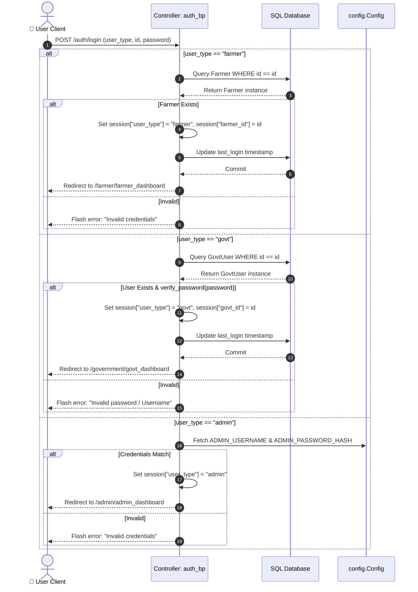
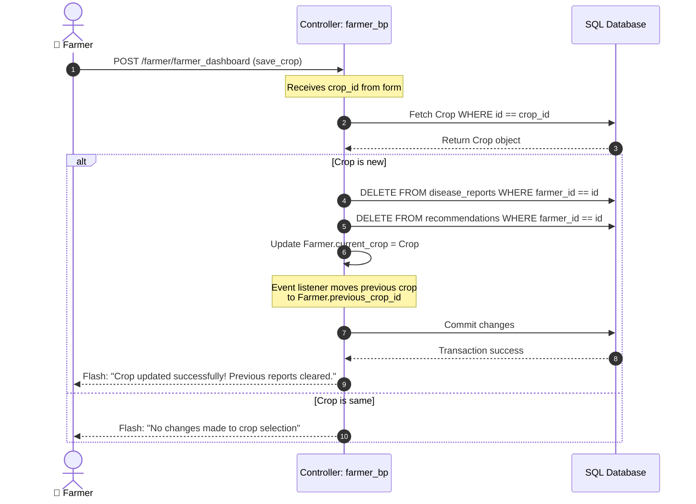
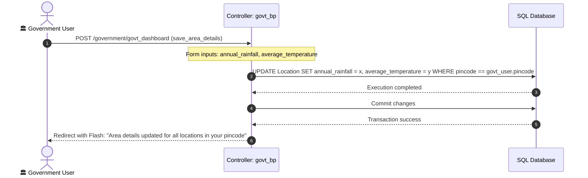
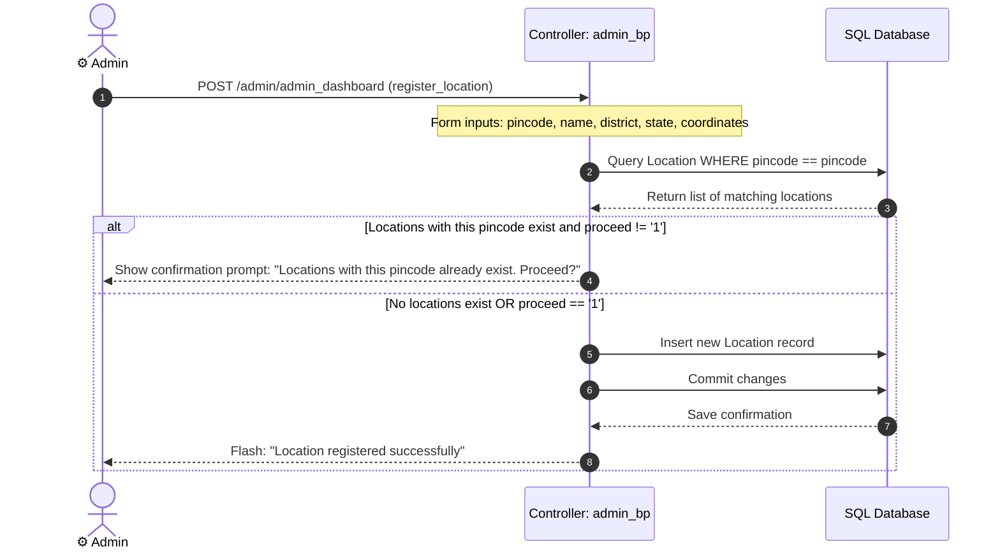

# Documentation

[Home](../README.md) | [Architecture](architecture.md) | [Modules](modules.md) | [AI Pipelines](ai-pipelines.md) | [Database](database.md) | [API](api.md) | [Deployment](deployment.md) | [Roadmap](roadmap.md) | [Developer Guide](developer-guide.md) | [Security](security.md) | [Testing](testing.md) | [Performance](performance.md)

---

## Table of Contents

- [Overview](#overview)
- [1. Authentication Module (auth)](#1-authentication-module-auth)
  - [Sequence Diagram: Login Sequence](#sequence-diagram-login-sequence)
- [2. Farmer Module (farmer)](#2-farmer-module-farmer)
  - [Sequence Diagram: Crop Update Sequence](#sequence-diagram-crop-update-sequence)
- [3. Government Module (government)](#3-government-module-government)
  - [Sequence Diagram: Regional Dashboard Data Sync](#sequence-diagram-regional-dashboard-data-sync)
- [4. Administrative Module (admin)](#4-administrative-module-admin)
  - [Sequence Diagram: Location Registry Verification](#sequence-diagram-location-registry-verification)
- [5. Artificial Intelligence Module (ai_services)](#5-artificial-intelligence-module-ai_services)
- [6. Utilities Module (utils)](#6-utilities-module-utils)

---

## Overview

The Smart Farming AI platform is divided into distinct, cohesive blueprints. Each module is self-contained with its own routes, form validation layers, and services, communicating through the shared SQLAlchemy database layer.

---

## 1. Authentication Module (auth)

### Purpose
Manages session-based authentication, user registration, logout procedures, secure cookies, and dynamic location AJAX calls.

### Responsibilities
- Renders and processes the user login page for three distinct roles: Farmer, Government User, and Admin.
- Performs validation on farmer registration forms.
- Exposes location endpoints to fetch locations matching a specific postal pincode.
- Clears session cookies, revokes sessions, and sets HTTP cache headers on logout to prevent browser back-button access.

### Routes

| Method | Endpoint | Form / Input | Actions | Redirects / Output |
| :--- | :--- | :--- | :--- | :--- |
| **GET** | `/auth/` | None | Renders landing page | `index.html` |
| **GET / POST** | `/auth/login` | `LoginForm` (user_type, id, password) | Verifies credentials and creates active session keys | `/farmer/farmer_dashboard`, `/government/govt_dashboard`, or `/admin/admin_dashboard` |
| **GET** | `/auth/logout` | None | Clears session, invalidates cookies | Redirects to `/auth/login` |
| **GET / POST** | `/auth/register` | `RegisterForm` (name, user_id, pincode, location_id, phone, email, land_area) | Inserts Farmer profile and increments location count | Redirects to `/auth/login` on success |
| **GET** | `/api/locations` | Query param `pincode` (6 digits) | Validates pincode and queries locations database | JSON array of local location entities |

### Models Referenced
- `Farmer` (writes new records, updates last login time)
- `GovtUser` (queries user ID, verifies scrypt password hash, updates last login)
- `Location` (queries pincode directories, increments `no_of_farmers` upon registration)

### Templates
- `auth/login.html` (Secure form routing user_type, id, and password)
- `auth/register.html` (Dynamic location selector driven by JavaScript)
- `index.html` (Landing page)

### Dependencies
- `flask.Blueprint`
- `werkzeug.security.check_password_hash`
- `app.extensions.db`
- `app.auth.forms` (LoginForm, RegisterForm)

### Sequence Diagram: Login Sequence

This sequence diagram details the steps executed when a user logs into the application:

### Security Measures
- **Password Hashing:** Uses `generate_password_hash` with `scrypt:32768:8:1` format for all Government Users.
- **Admin Isolation:** Admin credentials reside in server environment variables rather than the database.
- **Cache Destruction:** The logout route injects headers (`Cache-Control: no-store`, `Pragma: no-cache`) to ensure session pages cannot be retrieved from browser history.

### Current Implementation
Fully implemented with session guards, AJAX-based location selection, and role segregation.

### Future Improvements
- **Two-Factor Authentication (2FA):** Integrate mobile SMS verification via external APIs for Farmer logins.
- **OIDC/OAuth Integration:** Allow registration using existing government identity portals (e.g., DigiLocker).

---

## 2. Farmer Module (farmer)

### Purpose
Houses all dashboards and toolsets dedicated to Farmers, including soil data logging, crop configuration, fertilizer analysis generation, and conversational AI.

### Responsibilities
- Displays agricultural indicators (total reports, current crop name, and soil status).
- Updates Farmer soil metrics (NPK and pH levels) upon request.
- Integrates Gemini AI vision wrappers to identify plant disease symptoms from uploaded files.
- Hosts the FarmBot conversation history, message generation, and cleanups.

### Routes

| Method | Endpoint | Input Parameters | Actions | Output / Redirects |
| :--- | :--- | :--- | :--- | :--- |
| **GET / POST** | `/farmer/farmer_dashboard` | Form parameters: option, soil_type, ph_level, nitrogen, phosphorus, potassium, selected_crop | Handles dashboard loading, soil data updates, crop changes, and fertilizer requests | `farmer/dashboard.html` |
| **GET / POST** | `/disease_detection` | File upload: image | Validates leaf image, invokes Gemini, saves diagnostic report to DB | JSON payload containing analysis results |
| **POST** | `/farmer/chatbot_query` | JSON body: query | Validates input, pulls Farmer details, fetches response | JSON string payload containing AI message |
| **GET** | `/farmer/chatbot_history` | None | Fetches message logs from user session | JSON array containing history array |
| **POST** | `/farmer/chatbot_clear` | None | Empties the session chatbot history cache | JSON response: `{"success": true}` |

### Models Referenced
- `Farmer` (updates soil parameters, links current crop, checks profile completeness)
- `Crop` (lists options, verifies selected crop IDs)
- `Recommendation` (logs generated NPK fertilizer reports and water requirements)
- `DiseaseReport` (writes diagnosed leaf diseases, treatments, and confidence levels)

### Templates
- `farmer/dashboard.html` (Farmer console containing widgets for soil, crop updates, disease analysis, and chatbot panel)
- `features/disease_detection.html` (Disease diagnostic file interface)

### Sequence Diagram: Crop Update Sequence

This sequence diagram details the process when a Farmer changes their current crop:

### Dependencies
- `@farmer_required` and `@session_required` decorators
- `app.ai_services` (`fertilizer_analysis`, `disease_detection`, `chatbot_ai`)
- `werkzeug.utils.secure_filename`

### Security Measures
- **Decorator Routing:** All actions are guarded to verify `session["user_type"] == "farmer"`.
- **Inactivity Purging:** Logs users out if their session shows no activity for 30 minutes.
- **Image Validation:** Rejects files that are not valid images and resizes them to 512x512 to prevent buffer overrun issues.

### Current Implementation
All routes, vision processing, chatbot sessions, and database integrations are fully operational.

### Future Improvements
- **Offline Sync:** Store chatbot history and recommendations in local browser storage (IndexedDB) for offline viewing.

---

## 3. Government Module (government)

### Purpose
Exposes administrative dashboards for local Government Users to register new farmers, edit existing agricultural settings, update rainfall data, and view statistics for their assigned pincodes.

### Responsibilities
- Computes aggregate metrics (total farmers and active crop counts) for the logged-in user's pincode.
- Updates geographic data (rainfall and average temperature) for all locations matching the user's pincode.
- Enables manual registration of farmers within the user's service area.
- Runs crop recommendation diagnostics on behalf of local farmers.

### Routes

| Method | Endpoint | Input Parameters | Actions | Output / Redirects |
| :--- | :--- | :--- | :--- | :--- |
| **GET / POST** | `/government/govt_dashboard` | Form parameters: option, search, status, farmer_id, selected_crop | Loads analytics charts, executes regional updates, searches farmers list, and runs crop analysis | `government/dashboard.html` |
| **GET / POST** | `/government/edit_farmer/<id>` | Form parameters: name, phone, email, soil_type, pH, NPK, land_area | Updates farmer profiles within the user's pincode | `admin/edit_farmer.html` |
| **POST** | `/government/remove_farmer` | Form parameter: farmer_id | Deletes a farmer profile from the user's pincode area | Redirects to `/government/govt_dashboard?option=view_farmers` |
| **GET** | `/government/get_user_details` | Query params: user_type, user_id | Fetches details for a single farmer profile | Rendered HTML block from `government/_farmer_details.html` |
| **POST** | `/government/govt_dashboard/save_crop` | Form parameters: farmer_id, selected_crop | Updates the crop selection for a farmer profile | Redirects to dashboard |
| **GET** | `/government/health` | None | Checks database connection health | JSON response: `{"status": "healthy"}` |

### Models Referenced
- `GovtUser` (reads user data, assigns statistics)
- `Farmer` (adds, edits, or deletes farmer profiles)
- `Location` (updates climate data, reads location lists)
- `Crop` (reads crop IDs)

### Templates
- `government/dashboard.html` (Regional analytics, statistics panels, search tables, registration tools, and soil recommendation panels)
- `government/_farmer_details.html` (Details view overlay for a single farmer profile)
- `admin/edit_farmer.html` (Reuse of admin edit layout for farmer details)

### Sequence Diagram: Regional Dashboard Data Sync

This sequence diagram details the process when a Government User updates regional climate parameters:

### Dependencies
- `@govt_required` and `@session_required` decorators
- `app.utils.helpers` (`update_govt_user_counts`)
- `app.utils.validation` (`validate_and_format_phone`)

### Security Measures
- **Role Isolation:** Government Users can only view, register, edit, or delete farmers within their assigned pincode. Attempts to modify profiles in other regions will trigger security warnings.

### Current Implementation
Provides full registration, editing, deletion, regional updates, and health monitoring features.

### Future Improvements
- **Geofencing:** Add map visualization overlays to prevent registering farmers outside their service area.

---

## 4. Administrative Module (admin)

### Purpose
Provides master-level configuration of the application, including managing user accounts, location directories, and the crop master catalog.

### Responsibilities
- Registers new Government Users and verifies their assigned pincodes.
- Creates new Location directories with latitude and longitude metrics.
- Searches, filters, and deletes registered farmers, Government Users, locations, and crops.
- Updates metadata (recommended NPK levels, scientific names, and production metrics) for crops.

### Routes

| Method | Endpoint | Input Parameters | Actions | Output / Redirects |
| :--- | :--- | :--- | :--- | :--- |
| **GET / POST** | `/admin/admin_dashboard` | Form parameters: option, search, filter, sort, proceed, forms | Manages entity lists, registers new locations, and adds Government Users | `admin/dashboard.html` |
| **GET / POST** | `/admin/edit_farmer/<id>` | Form fields: name, phone, email, soil parameters, area | Updates the profile details for any farmer | `admin/edit_farmer.html` |
| **GET / POST** | `/admin/edit_govt_user/<id>`| Form fields: name, phone, email, location_id, password | Modifies a Government User profile and updates their assigned locations | `admin/edit_govt_user.html` |
| **GET / POST** | `/admin/edit_location/<id>` | Form fields: name, state | Modifies location names and states | `admin/edit_location.html` |
| **POST** | `/admin/remove_farmer` | Form parameter: farmer_id | Removes a farmer profile and updates all associated counts | Redirects to dashboard |
| **POST** | `/admin/remove_govt_user` | Form parameter: govt_user_id | Deletes a Government User profile and updates associated location counts | Redirects to dashboard |
| **POST** | `/admin/remove_location` | Form parameter: location_id | Deletes a location if it has no registered farmers or Government Users | Redirects to dashboard |
| **POST** | `/admin/remove_crop` | Form parameter: crop_id | Deletes a crop from the master database catalog | Redirects to dashboard |
| **GET** | `/admin/get_user_details` | Query params: user_type, user_id | Fetches details for a single farmer or Government User | HTML snippet templates |
| **GET** | `/admin/get_location_details`| Query param: location_id | Fetches details for a single location profile | HTML snippet templates |
| **GET** | `/admin/get_crop_details` | Query param: crop_id | Fetches details for a single crop catalog entry | HTML snippet templates |
| **GET** | `/admin/get_locations/<pincode>`| URL parameter: pincode | Fetches locations associated with a pincode | JSON array of location details |

### Models Referenced
- `User`, `Farmer`, `GovtUser`, `Location`, `Crop`

### Templates
- `admin/dashboard.html` (Admin console with panels for lists, configuration tools, search utilities, and deletion controls)
- `admin/edit_farmer.html`, `admin/edit_govt_user.html`, `admin/edit_location.html`
- Details snippets: `admin/_farmer_details.html`, `admin/_govt_user_details.html`, `admin/_location_details.html`, `admin/_crop_details.html`

### Sequence Diagram: Location Registry Verification

This sequence diagram details the process when the Admin registers a new Location:

### Dependencies
- `@admin_required` and `@session_required` decorators
- `app.admin.forms` (RegisterGovtUserForm, RegisterLocationForm)
- `app.utils.helpers` (`update_location_users_counts`)

### Security Measures
- **Strict Role Restrictions:** Only the designated administrator account (configured via environment variables) can access routes under the `/admin` path.

### Current Implementation
Supports full system oversight, catalog adjustments, user profile updates, and database cleanup controls.

### Future Improvements
- **Bulk Uploads:** Enable importing locations and crops from CSV spreadsheets.

---

## 5. Artificial Intelligence Module (ai_services)

### Purpose
Wraps the Google Gemini 2.5 Flash API to handle natural language processing and computer vision diagnostics.

### Components

#### A. Crop Recommendation (`crop_recommendation.py`)
- Evaluates soil attributes (NPK and pH), regional climate data, and crop databases.
- Submits structured instructions to return a ranked list of 4–6 recommended crops.
- If the AI request fails, it falls back to database queries of historical regional crops.

#### B. Disease Detection (`disease_detection.py`)
- Standardizes uploaded crop photos (converts to RGB, resizes to 512x512, saves as JPEGs).
- Requests a JSON response with disease name, confidence score, symptoms, organic remedies, and chemical treatments.

#### C. Fertilizer Analysis (`fertilizer_analysis.py`)
- Evaluates soil NPK levels and pH metrics for a selected crop.
- Recommends application volumes and watering adjustments, returned in JSON format.

#### D. Chatbot AI (`chatbot_ai.py`)
- Reads the farmer's profile, including their soil metrics and history.
- Answers farming queries contextually, keeping responses clear and directly related to the farmer's data.

### Dependencies
- `google.generativeai` (SDK)
- `PIL.Image` (Pillow)
- `config.Config`

---

## 6. Utilities Module (utils)

### Purpose
Contains common helper functions, authentication decorators, format validators, and database count syncing utilities.

### Components

#### A. Route Decorators (`decorators.py`)
- `@farmer_required`: Verifies `session["user_type"] == "farmer"`.
- `@govt_required`: Verifies `session["user_type"] == "govt"`.
- `@admin_required`: Verifies `session["user_type"] == "admin"`.
- `@session_required`: Tracks user activity timestamps and logs users out after 10 minutes (for testing) or 30 minutes (in production) of inactivity.

#### B. Aggregate Counters (`helpers.py`)
- `update_govt_user_counts`: Recalculates total assigned and active farmers across all locations matching a Government User's pincode.
- `update_location_users_counts`: Updates farmer and Government User counts for a specific location.

#### C. Input Validators (`validation.py`)
- `validate_and_format_phone`: Formats Indian phone numbers to `+91XXXXXXXXXX` and displays validation errors for incorrect formats.

---

Previous: [Architecture](architecture.md) | Next: [AI Pipelines](ai-pipelines.md)
