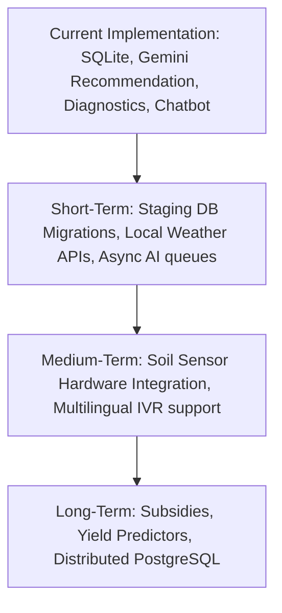

# Documentation

[Home](../README.md) | [Architecture](architecture.md) | [Modules](modules.md) | [AI Pipelines](ai-pipelines.md) | [Database](database.md) | [API](api.md) | [Deployment](deployment.md) | [Roadmap](roadmap.md) | [Developer Guide](developer-guide.md) | [Security](security.md) | [Testing](testing.md) | [Performance](performance.md)

---

## Table of Contents

- [Overview](#overview)
- [Milestones Flowchart](#milestones-flowchart)
- [Short-Term Milestones (Q3 - Q4 2026)](#short-term-milestones-q3---q4-2026)
- [Medium-Term Milestones (Q1 - Q2 2027)](#medium-term-milestones-q1---q2-2027)
- [Long-Term Milestones (Q3 - Q4 2027)](#long-term-milestones-q3---q4-2027)
- [Future AI Improvements](#future-ai-improvements)
- [Infrastructure Scaling Strategies](#infrastructure-scaling-strategies)

---

## Overview

This document outlines the milestones and scaling strategies for the Smart Farming AI platform. We prioritize features based on user feedback and regional usability requirements.

---

## Milestones Flowchart

The flowchart below maps our release schedule:

---

## Short-Term Milestones (Q3 - Q4 2026)

Focuses on system stability and resolving API latency bottlenecks:
- **Local Weather API Integration:** Fetch real-time temperature and rainfall data to validate recommendations against current weather conditions.
- **Asynchronous AI Request Queues:** Offload image and vision analysis to Celery background tasks to prevent HTTP request timeouts.
- **PostgreSQL Database Migration:** Migrate the database to PostgreSQL to support write locks in production environments.

---

## Medium-Term Milestones (Q1 - Q2 2027)

Focuses on physical hardware integrations and improving system accessibility:
- **Soil Sensor Hardware Integration:** Enable IoT gateways (such as ESP32 microcontrollers) to upload soil data directly to the database.
- **Multilingual IVR Interface:** Provide a telephone-based interactive voice response (IVR) interface for farmers with limited internet access.
- **Dynamic Crop Rotation Planner:** Add a rotation planning tool to help farmers schedule planting windows based on soil health metrics.

---

## Long-Term Milestones (Q3 - Q4 2027)

Focuses on expanding market integrations and scaling backend infrastructure:
- **Seed & Fertilizer Subsidy Tracking:** Integrate with local government portals to help eligible farmers track agricultural subsidies.
- **Market Price & Yield Forecasting:** Add forecasting tools to estimate market pricing and yield trends prior to harvest.
- **Direct-to-Market Portal:** Connect farmers directly with regional buyers to reduce transport costs and increase transparency.

---

## Future AI Improvements

Planned improvements to our AI models:
- **Local Vision Model Execution:** Run lightweight, local vision models (such as MobileNet v4) to classify common crop diseases offline.
- **Agricultural Model Fine-Tuning:** Fine-tune open LLMs (like Llama-3-8B) on regional agricultural datasets to generate more precise fertilizer and crop recommendations.

---

## Infrastructure Scaling Strategies

As our active user base grows, we plan to scale the infrastructure as follows:
- **Read-Replica Databases:** Route analytics queries to read-replicas, keeping the primary database free for active farmer transactions.
- **Distributed Cache Layer:** Implement a Redis cache layer to store frequently accessed data, such as location pincode files and crop catalogs, reducing database load.

---

Previous: [Contributing Guide](contributing.md) | Next: [Developer Guide](developer-guide.md)
